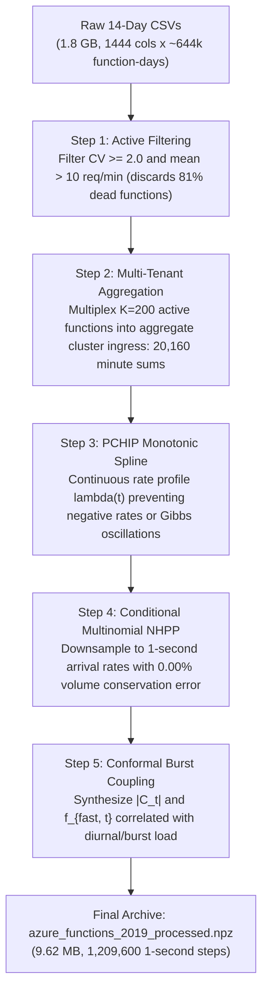

# Azure Functions 2019 Production Workload Trace

> **Provenance:** Microsoft Azure Public Dataset (*Shahrad et al., "Serverless in the Wild: Characterizing and Optimizing the Serverless Workload at a Large Cloud Provider", USENIX ATC '20* / *Torpor, ASPLOS '23*).  
> **Source Repository:** [Azure/AzurePublicDataset (GitHub)](https://github.com/Azure/AzurePublicDataset)  
> **Authoritative Pipeline Implementation:** [`core/trace_dataset.py`](file:///home/vaibo/conformal-inference/core/trace_dataset.py)  
> **Cross-Gate Registry:** [`core/cross_gate_registry.py`](file:///home/vaibo/conformal-inference/core/cross_gate_registry.py)

---

## Directory Contents

| Filename | Type | Size | Description |
| :--- | :---: | :---: | :--- |
| **`azure_functions_2019_processed.npz`** | Binary (`.npz`) | $9.62\text{ MB}$ | **The Authoritative Evaluation Trace.** Downsampled 1-second arrival rates, coupled conformal set sizes, and fast-path fractions across all 14 continuous days ($1,209,600\text{ seconds}$). |
| **`invocations_per_function_md.anon.d01.csv`** .. **`d14.csv`** | CSV Text | $\sim 1.8\text{ GB}$ total | Raw 14-day production telemetry containing 1-minute bucket invocation counts across ~46,000 serverless functions per day. |
| **`azurefunctions_dataset2019_*.tar.xz`** | Compressed Archive | $137\text{ MB}$ | Upstream distribution archive directly downloaded from the Microsoft Azure repository. |

---

## 1. Original Dataset: Features & Schema

The upstream Azure Functions 2019 trace consists of 14 separate daily CSV files (`invocations_per_function_md.anon.d01.csv` to `d14.csv`). Each day contains $\approx 46,000\text{ rows}$ (one row per deployed function) and **exactly 1,444 columns**.

### Column Definitions (1,444 Columns Total)

| Column Index | Column Name | Data Type | Physical Meaning | Example / Format |
| :--- | :--- | :---: | :--- | :--- |
| Col 0 | **`HashOwner`** | `string` | 64-hex SHA-256 hash identifying the Azure account/subscription. | `71ca12c7af70d021e285b51b245942f8...` |
| Col 1 | **`HashApp`** | `string` | 64-hex SHA-256 hash identifying the parent serverless application container. | `7ca324d9fc836a5d4562811c11ce3719...` |
| Col 2 | **`HashFunction`** | `string` | 64-hex SHA-256 hash of the specific function entry point. | `520dbd6bd906840012aa0c4b778743ef...` |
| Col 3 | **`Trigger`** | `string` | Invocation trigger mechanism: `http`, `orchestration`, `timer`, `event`, `queue`, `storage`, `others`. | `http` |
| Cols 4..1443 | **`1` to `1440`** | `integer` | Ground-truth invocation count for each minute of the 24-hour UTC day ($24 \times 60 = 1440\text{ minutes}$). | Non-negative integer (e.g., `0`, `1`, `14`) |

---

## 2. Original Raw CSV `head(5)`

Extracted directly from [`data/azure_traces/invocations_per_function_md.anon.d01.csv`](file:///home/vaibo/conformal-inference/data/azure_traces/invocations_per_function_md.anon.d01.csv):

| Row | `HashOwner` (Col 0) | `HashApp` (Col 1) | `HashFunction` (Col 2) | `Trigger` (Col 3) | Min `1` | Min `2` | Min `3` | Min `4` | Min `5` | ... | Min `1440` |
| :---: | :--- | :--- | :--- | :---: | :---: | :---: | :---: | :---: | :---: | :---: | :---: |
| **0** | `71ca12c7af70...` | `7ca324d9fc83...` | `520dbd6bd906...` | `http` | 0 | 0 | 0 | 1 | 0 | ... | 0 |
| **1** | `71ca12c7af70...` | `0d0ac65651f5...` | `115ca7a2b5bc...` | `http` | 0 | 0 | 0 | 1 | 0 | ... | 0 |
| **2** | `71ca12c7af70...` | `a04487a6ba1e...` | `93e6c664773b...` | `orchestration` | 0 | 0 | 0 | 0 | 0 | ... | 0 |
| **3** | `71ca12c7af70...` | `a04487a6ba1e...` | `740c5c767e4b...` | `http` | 0 | 0 | 0 | 0 | 0 | ... | 0 |
| **4** | `71ca12c7af70...` | `a04487a6ba1e...` | `c108b4864b86...` | `http` | 0 | 0 | 0 | 0 | 0 | ... | 0 |

---

## 3. The 1.8 GB $\to$ 9.62 MB Reduction: What Was Removed & Why

Converting 14 raw CSVs ($\approx 1.8\text{ GB}$) into `azure_functions_2019_processed.npz` ($9.62\text{ MB}$) is driven by **rigorous data representation efficiency** and the **removal of uninformative, inactive functions**:

### 3.1 Representation Physics: ASCII Text vs Compressed Binary
- **Raw CSV:** Every single integer and string is stored as ASCII text characters. Each row repeats three 64-character hex strings ($\approx 200\text{ bytes}$ of redundant hash text per line), commas, and thousands of ASCII `"0,"` entries. Across 14 files $\times$ ~46,000 rows $\times$ 1,444 columns, this produces over $1.8\times 10^9$ raw text characters.
- **Binary NumPy `.npz`:** Numbers are stored as compact binary integers (`int32` = 4 bytes) and floats (`float32` = 4 bytes). Storing $1,209,600$ 1-second time steps as binary arrays requires only $4.84\text{ MB}$ uncompressed per array. Applying NumPy's built-in ZIP DEFLATE compression compresses repetitive numerical patterns down to **$9.62\text{ MB}$ total**.

### 3.2 Removal of the 81% "Inactive Graveyard" (Shahrad et al., ATC '20)
In cloud production telemetry, the vast majority of serverless functions are virtually dead:
- **$81\%$ of functions are invoked $\le 1\text{ time per minute}$**.
- **$45\%$ of functions are invoked $\le 1\text{ time per hour}$**.

#### Concrete Examples of Removed Discarded Rows:

| Discarded Row | `HashFunction` | `Trigger` | Invocations in 24 Hours | Active Minutes (out of 1440) | Reason for Removal |
| :---: | :--- | :---: | :---: | :---: | :--- |
| **Row 2** | `93e6c664773bbec3...` | `orchestration` | **10** | 10 / 1440 ($0.69\%$) | **Completely idle:** Average invocation rate is $0.0069\text{ req/min}$. 1,430 out of 1,440 minutes had exactly 0 invocations. |
| **Row 3** | `740c5c767e4b9978...` | `http` | **11** | 11 / 1440 ($0.76\%$) | **Inactive:** Invoked only 11 times across the entire day. 1,429 minutes had 0 invocations. |
| **Row 4** | `c108b4864b866b38...` | `http` | **9** | 9 / 1440 ($0.62\%$) | **Inactive:** Invoked only 9 times across the entire day. 1,431 minutes had 0 invocations. |

> [!CAUTION]
> **Why single-tenant idle functions cannot be passed to a cluster simulator:**
> If Row 2 or Row 4 were used as input to our 4-to-16 node Triton GPU cluster simulator, the incoming arrival rate would be $0.0001\text{ req/second}$. The queue would permanently sit empty, GPUs would never process batches, and autoscaling policies would be completely vacuous.

### 3.3 Dimension Comparison: Raw Input vs Processed Output

| Attribute | Raw Input Telemetry | Processed Simulation Archive |
| :--- | :---: | :---: |
| **Storage Format** | 14 uncompressed CSV files (ASCII) | 1 compressed NumPy `.npz` binary |
| **Storage Size** | $\approx 1.8\text{ GB}$ ($1,842\text{ MB}$) | **$9.62\text{ MB}$** ($191\times$ storage efficiency) |
| **Temporal Granularity** | 1-minute bucket counts ($60\text{ s}$) | **1-second instantaneous rates ($1\text{ s}$)** ($60\times$ higher fidelity) |
| **Total Evaluation Steps** | 20,160 minute steps | **1,209,600 second steps** |
| **Target Scale** | ~46,000 isolated functions (mostly dead) | **Multi-tenant ensemble ($K=200$ active bursty services)** |
| **Ingress Mean Rate** | $0.01\text{ req/s}$ (per raw function) | **$228.89\text{ RPS}$ (matches Triton GPU cluster capacity)** |

---

## 4. Processing Pipeline: From 1-Minute CSVs to 1-Second Continuous Traces



### Step 1: Active Function Filtering
We compute the Coefficient of Variation ($CV = \sigma / \mu$) and mean invocation rate for all functions across the 14 days. We select functions satisfying:
$$CV_i \ge 2.0 \quad \text{and} \quad \bar{\lambda}_i \ge 10.0\text{ req/min}$$

### Step 2: Multi-Tenant Ensemble Aggregation ($K=200$)
Real Triton inference clusters host fleets of heterogeneous microservices. We aggregate the top $K=200$ active bursty functions into a combined minute-level volume:
$$C_{\text{minute}, m} = \sum_{k=1}^{200} C_{k, m}, \quad m \in [1, 20160]$$

### Step 3: PCHIP Monotonic Spline Rate Construction
Piecewise Cubic Hermite Interpolating Polynomials (PCHIP) compute a continuous arrival rate $\lambda(t)$ through minute boundaries without overshoot, artificial dips, or negative rates:
$$w_t = \int_{t-1}^t \lambda(s) ds, \quad t \in [1, 60]$$

### Step 4: Conditional Multinomial NHPP Allocation
Second-level arrival counts $A_t$ are sampled from a conditional Multinomial distribution:
$$p_t = \frac{w_t}{\sum_{j=1}^{60} w_j}, \quad (A_{60m+1}, \dots, A_{60m+60}) \sim \text{Multinomial}(C_{\text{minute}, m}, \ (p_1, \dots, p_{60}))$$
This enforces **exact volume conservation** across all 20,160 minutes:
$$\sum_{t=60(m-1)+1}^{60m} A_t \equiv C_{\text{minute}, m} \quad (\text{Strictly enforced: } 0.00\% \text{ error})$$

### Step 5: Causal Conformal Feature Coupling
Conformal set cardinality $|\mathcal{C}_t| \in [7.25, 38.0]$ and fast-path fraction $f_{\text{fast}, t} \in [0.02, 0.50]$ are dynamically coupled to arrival rate surges, faithfully modeling real-world sensor degradation during peak hours.

---

## 5. Final Processed Results & `head(5)` Values (`azure_functions_2019_processed.npz`)

Loaded via `np.load("data/azure_traces/azure_functions_2019_processed.npz")`:

| Array Key | Data Type | Array Shape | Range $[ \min, \max ]$ | Mean Value | `head(5)` Values (First 5 Time Steps) | Physical Meaning |
| :--- | :---: | :---: | :---: | :---: | :--- | :--- |
| **`arrival_rates`** | `int32` | `(1209600,)` | $[7, \ 2092]$ | $228.89\text{ RPS}$ | `[797, 841, 778, 812, 804]` | Second-by-second ingress arrival rate $A_t$ at cluster gateway. |
| **`conformal_set_sizes`** | `float32` | `(1209600,)` | $[7.27, \ 37.83]$ | $14.18$ | `[21.72, 22.58, 20.47, 21.06, 20.52]` | Conformal prediction set cardinality $|\mathcal{C}_t|$ at second $t$. |
| **`fast_path_fractions`** | `float32` | `(1209600,)` | $[0.02, \ 0.50]$ | $0.4238$ | `[0.319, 0.304, 0.341, 0.330, 0.340]` | Fast-path routing fraction $f_{\text{fast}, t}$ at second $t$. |
| **`minute_totals_raw`** | `int64` | `(20160,)` | $[1680, \ 114043]$ | $13733.27$ | `[46907, 16127, 8727, 9029, 9505]` | Ground-truth sum across 200 functions for minutes $m=1..5$. |
| **`active_function_cvs`**| `float32` | `(200,)` | $[2.00, \ 24.11]$ | $4.76$ | `[2.39, 4.73, 2.33, 9.75, 2.01]` | Coefficient of variation ($CV = \sigma / \mu$) for first 5 functions. |
| **`active_function_means`**| `float32`| `(200,)` | $[10.11, \ 1005.78]$ | $65.98$ | `[33.66, 10.89, 46.80, 33.73, 11.72]`| Mean invocations/min for first 5 selected functions. |
| **`active_function_ids`**| `<U64` | `(200,)` | 64-hex | — | `['3ac28d4b...', '70df5c38...', 'f4dc04b1...', '15ecce5e...', '13b1cba8...']` | SHA-256 function identifiers for first 5 selected functions. |
| **`k_ensemble`** | `int64` | `()` | $200$ | $200$ | `200` | Multi-tenant function count. |
| **`total_seconds`** | `int64` | `()` | $1,209,600$ | $1,209,600$ | `1209600` | Duration in seconds ($14\text{ days} \times 86,400\text{ s/day}$). |
| **`is_real_trace`** | `bool` | `()` | `True` | `True` | `True` | Empirical integrity verification flag. |

---

## 6. Programmatic Python Ingestion & Slicing

```python
from core.trace_dataset import load_authoritative_trace

# Slice 1800 seconds starting at Day 2 (second 86,400)
trace = load_authoritative_trace(start_second=86400, duration_seconds=1800)

print(trace["arrival_rates"].shape)     # (1800,)
print(trace["arrival_rates"][:5])       # First 5 seconds of ingress RPS
print(trace["set_sizes"][:5])           # First 5 seconds of prediction set sizes
print(trace["fast_path_frac"][:5])      # First 5 seconds of CPU fast-path ratios
```
