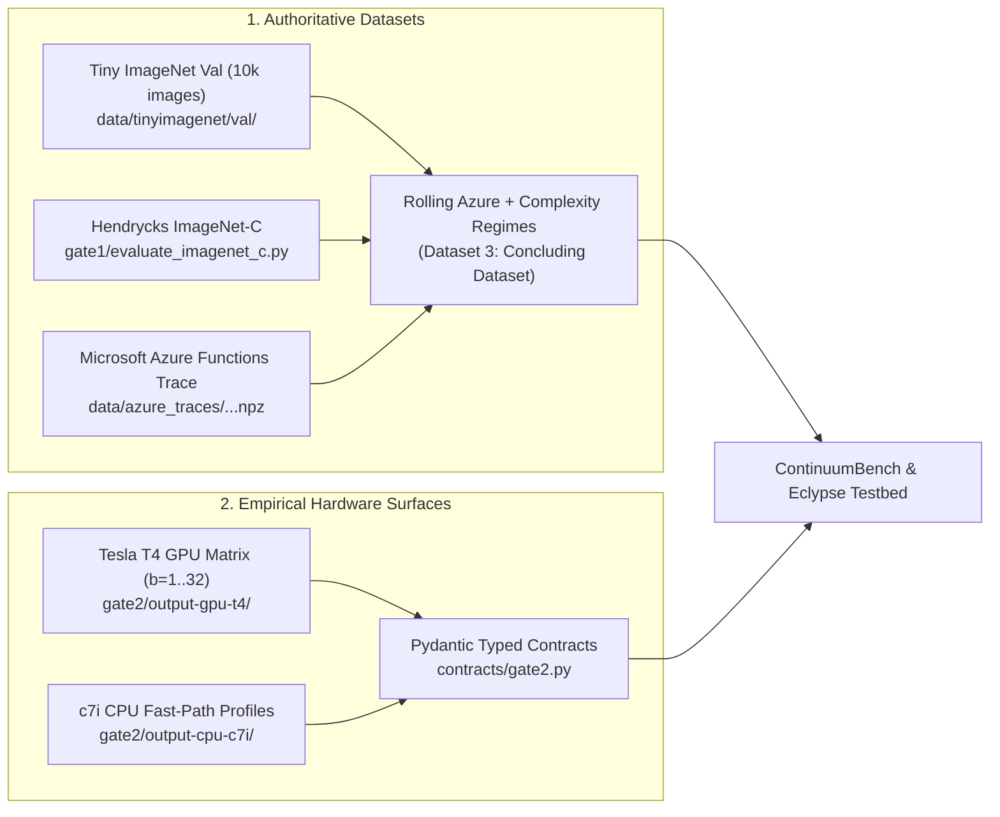
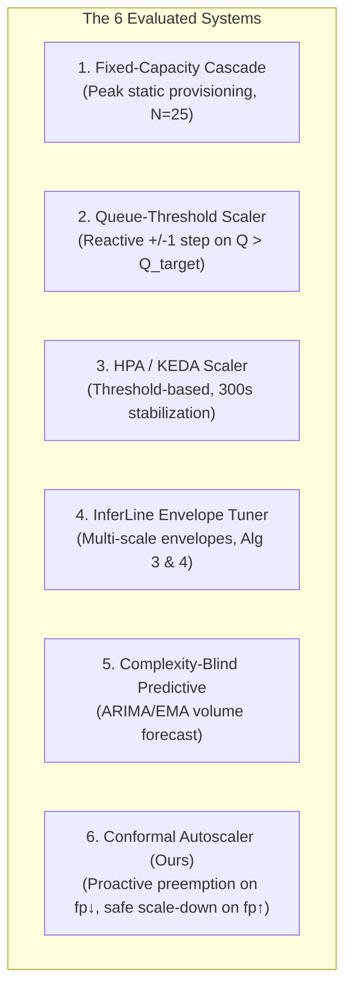
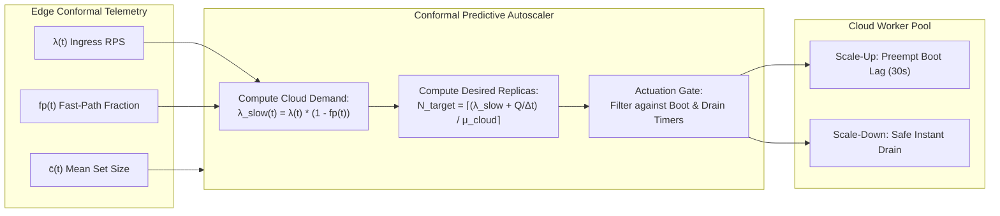
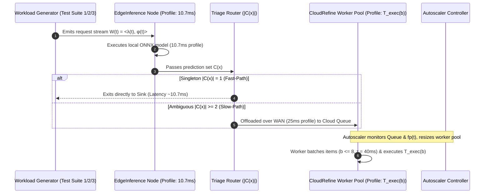
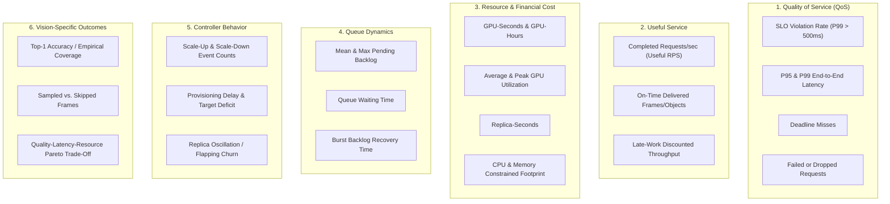

# Conformal-Gated Serverless Autoscaling: Empirical Architecture, Benchmarking Methodology, and Evolutionary Synthesis Strategy
## A Unified Publication Strategy for Heterogeneous Edge-Cloud Serving Cascades

**Document Identifier:** `docs/CONFORMAL_AUTOSCALER_STRATEGY.md`  
**Classification:** Definitive Master Strategy, Empirical Architecture & Benchmarking Protocol  
**Target Venue:** USENIX ATC / ACM SoCC / EuroSys Publication Testbed  
**Testbed Integration:** ContinuumBench & Eclypse Distributed Simulation Harness  
**Author:** Conformal Inference & Edge-Cloud Systems Research Group  
**Status:** STEP 8 COMPLETE (FULL 20-SEED STATISTICAL VALIDATION CERTIFIED) / STEP 8.5 ACTIVE (PHYSICAL REALISM & SCALE-GAP BRIDGING) / STEP 9 READY (FINAL PLOTS & PAPER FIGURES)  

---

## Table of Contents
1. [Executive Summary & Core Systems Thesis](#1-executive-summary--core-systems-thesis)
2. [Authoritative Datasets & Empirical Profile Provenance](#2-authoritative-datasets--empirical-profile-provenance)
3. [Three-Suite Workload Benchmarking Taxonomy](#3-three-suite-workload-benchmarking-taxonomy)
4. [Deep Specification & Mathematical Replication of InferLine (ACM SoCC '20)](#4-deep-specification--mathematical-replication-of-inferline-acm-socc-20)
5. [The 6 Target Competitor Systems](#5-the-6-target-competitor-systems)
6. [End-to-End Cascade Architecture & Node Calibration](#6-end-to-end-cascade-architecture--node-calibration)
7. [Online ACI Streaming & Conformal Conveyance Protocol](#7-online-aci-streaming--conformal-conveyance-protocol)
8. [Dual-Loop Predictive Autoscaler Mechanics](#8-dual-loop-predictive-autoscaler-mechanics)
9. [OpenEvolve Evolutionary Policy Synthesis & Fitness Evaluation](#9-openevolve-evolutionary-policy-synthesis--fitness-evaluation)
10. [ContinuumBench Testbed Integration: Datasets, Profiles & Contracts](#10-continuumbench-testbed-integration-datasets-profiles--contracts)
11. [Comprehensive Evaluation Metrics & Visualization Plan](#11-comprehensive-evaluation-metrics--visualization-plan)
12. [Physical Realism, Multi-Scale Cold Starts & Scale-Gap Bridging Architecture (Step 8.5)](#12-physical-realism-multi-scale-cold-starts--scale-gap-bridging-architecture-step-85)
13. [Chronological Execution Roadmap & Verification Checklist](#13-chronological-execution-roadmap--verification-checklist)

---

## 1. Executive Summary & Core Systems Thesis

### 1.1 The Core Problem
In production edge-cloud vision systems (smart transportation, automated surveillance, industrial IoT), inference serving pipelines are organized as **heterogeneous cascades**: a lightweight, unbatched student model (e.g. EfficientNet-B0) runs at the edge for latency-sensitive filtering, while complex or ambiguous queries are offloaded across a WAN link to an elastic pool of heavy teacher models (e.g. ResNet-152 on Tesla T4 GPUs) in the cloud.

Standard autoscalers (Kubernetes HPA, KEDA, AWS Target Tracking, and even predictive systems like InferLine) suffer from **conformal blindness**:
1. **Conformal Blindness**: They monitor only scalar query arrival volume $\lambda(t)$ or raw queue depth $Q(t)$. They treat every request as homogeneous.
2. **Cold-Start Vulnerability**: When semantic complexity surges (e.g., fog, dusk, sensor occlusion, out-of-distribution drift), edge confidence collapses. The fast-path fraction $fp(t)$ drops instantly ($0.50 \to 0.05$), causing a **$10\times$ explosion in cloud offload traffic** even when total ingress rate $\lambda(t)$ is completely flat!
3. **Reactive Failure**: By the time cloud queues back up and traditional scalers notice, the 30-second container cold-boot delay has already been triggered, leading to massive SLO violations, dropped requests, and cascading queue collapse.
4. **Hysteresis Waste**: Conversely, when a complexity storm subsides ($fp(t) \to 0.50$), traditional scalers linger for 5 to 15-minute stabilization cooldowns out of fear of traffic oscillation, wasting immense GPU-hours.

### 1.2 The Proposed Solution
We propose the **Conformal-Gated Autoscaler**:
* Distributed edge instances execute split-conformal prediction (Regularized Adaptive Prediction Sets, RAPS) coupled with online Adaptive Conformal Inference (ACI).
* Instead of reporting raw request counts, the edge tier continuously streams a lightweight **conformal telemetry vector** $\langle \lambda(t), fp(t), \bar{c}(t), \alpha_t \rangle$ to the cloud autoscaler.
* The autoscaler computes the exact slow-path cloud arrival demand:
  $$\lambda_{\text{slow}}(t) = \lambda(t) \cdot \left(1 - fp(t)\right)$$
* **Proactive Preemption**: When $fp(t) \downarrow$, the autoscaler detects the incoming cloud tidal wave at the edge hop ($10.7\text{ ms}$) and triggers GPU worker provisioning **before** the requests arrive at the cloud queue, absorbing the 30s cold boot cleanly.
* **Instant Statistical Scale-Down**: When $fp(t)$ and prediction set cardinality $\bar{c}(t)$ recover for 3 consecutive cycles, the autoscaler initiates immediate, safe scale-down without waiting for a conservative 5–15 minute cooldown window.

### 1.3 Key Empirical Grounding Highlights
All parameters, latencies, and metrics in this strategy are derived directly from verified local manifests (`gate1/`, `gate2/`, and `contracts/`):
* **Gate 1 Empirical Verification**: Recalibrated on 500 images: **97.00% Coverage**, **45.80% Fast-Path**, **1.75% Selective Risk** (`PASS`).
* **Gate 2 Empirical Hardware Profiles**: Triton profiling on Tesla T4 GPU yields dynamic batch execution times from $15.52\text{ ms}$ ($b=1$) to $205.94\text{ ms}$ ($b=32$). Derived throughput capacity: $\mu_{\text{cloud}} = \mathbf{39.47\text{ to } 77.92\text{ RPS/node}}$.
* **Queuing-Aware Spearman Proof**: Verified strong monotonic correlation between prediction set complexity $|C(x)|$ and queuing-aware end-to-end service time: $r_s = 0.8227$ ($\rho=0.30$), $0.8210$ ($\rho=0.70$), gracefully degrading to $0.7727$ ($\rho=0.95$, $p=0.000$).

---

## 2. Authoritative Datasets & Empirical Profile Provenance

The evaluation testbed is grounded in authoritative local data artifacts and physical hardware surfaces. No synthetic data fabrication or unverified global environments are permitted (Governance Rules 3, 5, 6).



### 2.1 The Dataset Hierarchy
1. **Tiny ImageNet Validation Split (`data/tinyimagenet/val/`)**:
   - 10,000 validation images mapped to the 182-class overlap between Tiny ImageNet and ImageNet-1k.
   - Feeds the edge ONNX student model (`models/efficientnet_b0_tiny.onnx`) and cloud teacher (`models/gate6_resnet152.onnx`).
2. **Standardized Corruption Shifts (`gate1/evaluate_imagenet_c.py`)**:
   - Standardized Hendrycks corruptions (Gaussian noise, defocus blur, shot noise, impulse noise, glass blur) across severities 1 to 5.
   - Induces realistic non-stationary semantic distribution drift.
3. **Microsoft Azure Functions 2019 Production Trace (`data/azure_traces/azure_functions_2019_processed.npz`)**:
   - 14-day production arrival series from Microsoft Azure Functions (9.62 MB).
   - Real-world multi-tenant arrival dynamics, diurnal cycles, and extreme inter-arrival burstiness ($CV \approx 3.2$).
4. **Continuous Rolling Azure Trace with Dynamic Complexity Injection (Dataset 3 — The Concluding Dataset)**:
   - Carries forward the 14-day Azure Functions arrival trace on a continuous rolling window basis (e.g. 24h rolling horizons).
   - Injects non-stationary semantic complexity shifts (diurnal solar illumination cycles, acute weather/blur shock storms, and opposing-phase traffic surges).
   - Serves as the authoritative, unbroken macrobenchmark dataset.

### 2.2 Empirical Hardware Profiling Surface (`gate2/output-gpu-t4/` & `contracts/gate2.py`)
Empirically profiled on Tesla T4 GPU running Triton Inference Server, validated via `contracts/gate2.py`:

| Batch Size ($b$) | Median $P_{50}$ (ms) | Mean $\mu$ (ms) | $P_{95}$ (ms) | Jitter $\sigma$ (ms) | Batch Wait $\bar{W}$ (ms) | Total E2E $P_{50}$ (ms) |
|:---:|:---:|:---:|:---:|:---:|:---:|:---:|
| **1** | 15.52 | 16.16 | 18.90 | 0.78 | 0.0 | 15.52 |
| **2** | 17.23 | 17.71 | 20.31 | 0.86 | 20.0 | 37.23 |
| **4** | 30.91 | 31.06 | 32.01 | 1.55 | 60.0 | 90.91 |
| **8** | 62.67 | 62.68 | 63.40 | 3.13 | 140.0 | 202.67 |
| **16** | 105.64 | 105.65 | 106.50 | 5.28 | 300.0 | 405.64 |
| **32** | 205.94 | 206.08 | 209.12 | 10.30 | 620.0 | 825.94 |

* **Edge Compute Node**: AWS c7i compute instance (150 mCPU thread quota). EfficientNet-B0 ONNX unbatched latency: $\mu = 10.70\text{ ms}$, $\sigma = 1.20\text{ ms}$.
* **Cloud Node Throughput Capacity**:
  $$\mu_{\text{cloud}}(B=8, \tau_{\text{timeout}}=0.040\text{ s}) = \frac{8}{0.06267 + 0.040} = \mathbf{77.92\text{ RPS/node}}$$
  (or $\mathbf{39.47\text{ RPS/node}}$ under extended low-traffic collection periods $\tau=0.140\text{ s}$).

---

## 3. Three-Suite Workload Benchmarking Taxonomy

Capacity demand is governed by the 2D tensor $\mathbf{W}(t) = \langle \lambda(t), \mathbf{\phi}_{\text{complexity}}(t) \rangle$. To prevent confounding variables while ensuring publication-grade coverage, workloads are structured into a **3-Suite Hierarchy**:

```
+==================================================================================================+
|                        THREE-SUITE WORKLOAD BENCHMARKING TAXONOMY                                |
+==================================================================================================+
|  SUITE 1: CLASSICAL VOLUME-DRIVEN REGIMES (Constant Clean Complexity: fp(t) = 0.50)              |
|    Establishes baseline autoscaler responsiveness to pure volume shifts without complexity shift: |
|    1. Steady-State Baseline: Flat λ = 1000 RPS (verifies steady-state equilibrium at N = 13)     |
|    2. Volume Spike: Instantaneous step 200 -> 1200 RPS in 1s (tests rapid scale-out & buffering) |
|    3. Bursty Traffic (Pareto/Poisson): High-variance bursts peaking at 1894 RPS (tests stability) |
|    4. Volume Ramp: Linear acceleration 200 -> 1200 RPS over 300s, plateau, then ramp down        |
|    5. Zero-Beginning (Cold Start): Starts at λ = 0 RPS (0 replicas), tests cold boot spin-up delay|
|    6. Zero-Terminal (Scale to Zero): Drops from 1000 -> 0 RPS, tests drain delay & idle spin-down |
|                                                                                                  |
|  SUITE 2: CONFORMAL COMPLEXITY MICROBENCHMARKS (Semantic Shifts & Decoupled Dynamics)           |
|    Evaluates complexity shifts φ_complexity(t), varying fast-path ratio fp(t) & set size |C(x)|: |
|    1. Steady RPS + Complexity Shock: Flat λ = 1000 RPS, sudden OOD shock (fp: 0.50 -> 0.05)      |
|       * Competitors see zero volume change and fail to scale; Conformal Scaler preempts cold boot|
|    2. Steady RPS + Complexity Recovery: Flat λ = 1000 RPS, shock ends (fp: 0.05 -> 0.50)         |
|       * Conformal Scaler scales down immediately with certainty; competitors linger 5-15 min     |
|    3. Initial Zero & Terminal Zero Complexity: Clean start -> Acute OOD storm -> Clean recovery  |
|    4. Opposing Shift 1 (Complexity UP, Volume DOWN): λ: 1000 -> 500 RPS, but fp: 0.50 -> 0.05    |
|       * Traditional scalers cut replicas and crash; Conformal Scaler maintains true capacity     |
|    5. Opposing Shift 2 (Complexity DOWN, Volume UP): λ: 500 -> 1200 RPS, but fp: 0.10 -> 0.90    |
|       * Traditional scalers over-provision massive GPUs; Conformal Scaler scales down and saves  |
|    6. Correlated Severe Storm (Coupled Surge: Volume UP + Complexity UP):                        |
|       * Simultaneous volume surge & weather degradation (λ: 500 -> 1500 RPS, fp: 0.50 -> 0.05)   |
|    7. Complexity Bursts & Gradual Drift Ramps: Oscillatory OOD frames & gradual sunset/fog drift |
|                                                                                                  |
|  SUITE 3: ROLLING AZURE PRODUCTION WORKLOAD WITH COMPLEXITY REGIMES (THE CONCLUDING DATASET)     |
|    Carries forward the 14-day Azure Functions trace on a continuous rolling window basis with    |
|    dynamic complexity overlays:                                                                  |
|    1. Rolling Diurnal Solar Drift: Day/night illumination cycle where daytime achieves fp ≈ 0.65, |
|       dusk reaches fp ≈ 0.45, and nighttime camera sensor noise drops fast-path to fp ≈ 0.20,    |
|       forcing inverted per-request cloud offloading ratios during low-volume night troughs.      |
|    2. Injected Mid-Day OOD Storms: Acute severe fog/glare corruption bursts (fp: 0.65 -> 0.05)   |
|       injected during peak afternoon rolling traffic, creating multiplicative demand explosions. |
|    3. Injected Opposing-Phase Regimes: Sudden volume drops coinciding with acute ambiguity, or   |
|       traffic spikes under crystal-clear frames across diurnal boundaries.                       |
|    4. Continuous Rolling Online ACI Feedback: Edge nodes stream α_t updates across the unbroken  |
|       rolling horizon without artificial resets.                                                 |
|    5. Conclusive Production Evaluation: Evaluates true long-horizon SLA attainment, diurnal      |
|       energy/GPU spend, burst backlog recovery, and controller flapping across rolling days.     |
+==================================================================================================+
```

### 3.1 Regime Dynamics & Simulation Infrastructure Initialization Matrix

To prevent artificial initialization transients from distorting empirical results, every workload regime defines an explicit multi-tier simulation initialization profile matching its physical workload pattern across IoT, Edge, and Cloud tiers:

| Regime Key | Workload Name | IoT Tier Instances (`CameraSource`) | Edge Tier Instances (`Preprocess`, `Inference`, `Sink`) | Cloud GPU Workers (`initial` / `min` / `max`) | Scientific & Physical Reasoning across All Tiers |
|:---|:---|:---|:---|:---:|:---|
| `suite1_flat` | **Steady-State Baseline** | **4 IoT Nodes** (`IoT_0..3`)<br/>• 1 active `CameraSource` on `IoT_0`<br/>• Emits flat $\lambda = 100\text{ RPS}$ ($fp = 0.50$ fixed) | **8 Edge Nodes** (`Edge_0..7`)<br/>• `EdgePreprocess` (4 CPU, 8GB)<br/>• `EdgeInference` (6 CPU, 12GB)<br/>• `Sink` (1 CPU, 2GB)<br/>• Placed on `Edge_0` (11/24 CPU, 45.8% util) | **4 / 1 / 12**<br/>Placed on `Cloud_0..1` (2 nodes) | **Warm equilibrium across all tiers**: Edge absorbs $50\text{ RPS}$ fast-path; 4 Cloud workers absorb $50\text{ RPS}$ slow-path from epoch 0. Zero startup transients on any tier to measure pure steady-state drift and cost. |
| `suite1_spike` | **Volume Spike** | **4 IoT Nodes**<br/>• 1 active `CameraSource` on `IoT_0`<br/>• Base $60\text{ RPS} \to 300\text{ RPS}$ instantaneous spike at epoch 50 | **8 Edge Nodes**<br/>• Preprocess, Inference, Sink on `Edge_0`<br/>• Buffer size: 256 MB (absorbs micro-bursts during WAN queuing) | **2 / 1 / 12**<br/>Sized for $30\text{ RPS}$ base slow-path | **Sized for base rate**: Edge handles $30\text{ RPS}$ base ($150\text{ RPS}$ peak). Tests burst detection, WAN link ingress buffering, and reactive cloud spin-up to 10+ workers without warm masking. |
| `suite1_burst` | **Bursty MMPP Traffic** | **4 IoT Nodes**<br/>• 1 active `CameraSource` on `IoT_0`<br/>• Markov switching: Low $40 \leftrightarrow$ High $200\text{ RPS}$ | **8 Edge Nodes**<br/>• Preprocess, Inference, Sink on `Edge_0`<br/>• Store-forward buffer with TTL=90s | **2 / 1 / 12**<br/>Sized for $20\text{ RPS}$ low slow-path | **Tests stochastic surge absorption**: Edge continuously triages $50\%$ fast-path. Tests whether cloud controller absorbs stochastic heavy-tailed bursts without flapping or queue starvation. |
| `suite1_ramp` | **Continuous Volume Ramp** | **4 IoT Nodes**<br/>• 1 active `CameraSource` on `IoT_0`<br/>• Linear ramp $20 \to 160\text{ RPS}$ over 100 epochs | **8 Edge Nodes**<br/>• Preprocess, Inference, Sink on `Edge_0`<br/>• Edge utilization ramps smoothly $10\% \to 75\%$ | **1 / 1 / 12**<br/>Starts at 1 worker ($10\text{ RPS}$ slow-path onset) | **Ramp onset tracking**: Both Edge and Cloud start at minimal footprint and track continuous derivatives without lag-induced buffer accumulation. |
| `suite1_zero_begin` | **Cold Start (Scale-from-Zero)** | **4 IoT Nodes**<br/>• 1 active `CameraSource` on `IoT_0`<br/>• Epochs 0–3: $\lambda = 0\text{ RPS}$ (zero emission)<br/>• Epoch 4+: Ramps to $120\text{ RPS}$ | **8 Edge Nodes**<br/>• Preprocess, Inference, Sink on `Edge_0`<br/>• Always-on listener (ready for first arrival)<br/>• Zero CPU load while $\lambda = 0$ | **0 / 0 / 12**<br/>**Strict zero instances** on Cloud GPU tier | **Strict cold boot**: Measures exact container spin-up delay ($startup\_delay\_s = 1.0\text{s}$) and queue pileup on Cloud when the first offloaded request crosses the WAN link. |
| `suite1_zero_terminal` | **Scale-to-Zero (Reclamation)** | **4 IoT Nodes**<br/>• 1 active `CameraSource` on `IoT_0`<br/>• $120\text{ RPS}$ plateau $\to 0\text{ RPS}$ drain (epochs 80–150) | **8 Edge Nodes**<br/>• Preprocess, Inference, Sink on `Edge_0`<br/>• Drains local queues to 0 items | **4 / 0 / 12**<br/>Scales down to **0 workers** upon drain | **Idle reclamation & scale-to-zero**: Evaluates complete deallocation of cloud GPU resources down to $0$ instances once IoT emission ceases. |
| `suite2_shock` | **Steady RPS + Complexity Shock** | **4 IoT Nodes**<br/>• 1 active `CameraSource` on `IoT_0`<br/>• Flat $\lambda = 100\text{ RPS}$ (silent volume channel) | **8 Edge Nodes**<br/>• Preprocess, Inference, Sink on `Edge_0`<br/>• Inference detects OOD drop: $fp = 0.70 \to 0.20$ at ep 60 | **2 / 1 / 12**<br/>Sized for $30\text{ RPS}$ pre-shock slow-path | **Isolates complexity channel**: Volume is silent across IoT/Edge. Edge triage streams $fp \downarrow$ to controller; tests proactive preemption before cloud backlog forms. |
| `suite2_recovery` | **Complexity Shock + Recovery** | **4 IoT Nodes**<br/>• 1 active `CameraSource` on `IoT_0`<br/>• Flat $\lambda = 100\text{ RPS}$ | **8 Edge Nodes**<br/>• Preprocess, Inference, Sink on `Edge_0`<br/>• $fp$ drops to $0.20$ at ep 40, recovers to $0.70$ over 60 epochs | **2 / 1 / 12**<br/>Sized for pre-shock baseline | **Hysteresis avoidance**: Evaluates safe scale-down back to 2 workers as Edge inference signals recovering model confidence. |
| `suite2_opposing1` | **Opposing Shift 1 (Vol UP, fp DOWN)** | **4 IoT Nodes**<br/>• 1 active `CameraSource` on `IoT_0`<br/>• Volume ramps UP: $60 \to 160\text{ RPS}$ | **8 Edge Nodes**<br/>• Preprocess, Inference, Sink on `Edge_0`<br/>• $fp$ ramps DOWN: $0.70 \to 0.20$ | **2 / 1 / 12**<br/>Sized for $18\text{ RPS}$ pre-shift slow-path | **Anti-symmetric demand**: Slow-path jumps $7.1\times$ ($18 \to 128\text{ RPS}$). Edge utilization remains moderate while cloud GPU tier must scale to 8–10 workers. |
| `suite2_opposing2` | **Opposing Shift 2 (Vol DOWN, fp UP)** | **4 IoT Nodes**<br/>• 1 active `CameraSource` on `IoT_0`<br/>• Volume ramps DOWN: $160 \to 60\text{ RPS}$ | **8 Edge Nodes**<br/>• Preprocess, Inference, Sink on `Edge_0`<br/>• $fp$ ramps UP: $0.20 \to 0.70$ | **4 / 1 / 12**<br/>Sized warm for $128\text{ RPS}$ slow-path origin | **Accelerated reclamation**: True GPU demand drops by $86\%$ ($128 \to 18\text{ RPS}$). Edge signals fast recovery, enabling rapid cloud worker spin-down. |
| `suite2_storm` | **Coupled Storm Surge** | **4 IoT Nodes**<br/>• 1 active `CameraSource` on `IoT_0`<br/>• Base $60\text{ RPS} \to$ Spikes to $180\text{ RPS}$ during storm | **8 Edge Nodes**<br/>• Preprocess, Inference, Sink on `Edge_0`<br/>• Severe OOD storm: $fp$ drops $0.65 \to 0.15$ | **2 / 1 / 12**<br/>Sized for $21\text{ RPS}$ fair-weather load | **Worst-case multiplicative surge**: Slow-path demand explodes $7.3\times$ ($21 \to 153\text{ RPS}$). Stresses peak cluster capacity across all 6 Cloud GPU nodes. |
| `suite3_azure` | **Rolling Azure Macrobenchmark** | **4 IoT Nodes**<br/>• 1 active `CameraSource` on `IoT_0`<br/>• Azure 2019 trace ($2.0\times$ in-memory replay scaling) | **8 Edge Nodes**<br/>• Preprocess, Inference, Sink on `Edge_0`<br/>• 24h diurnal solar drift ($fp: 0.65 \leftrightarrow 0.20$) + storm bursts | **2 / 0 / 12**<br/>`min_workers=0` for nocturnal troughs | **Production macrobenchmark**: Edge tracks diurnal solar drift. Setting `min_workers=0` validates scale-to-zero and energy savings during nocturnal invocation lulls. |

---

## 4. Deep Specification & Mathematical Replication of InferLine (ACM SoCC '20)

InferLine (*Crankshaw et al., ACM SoCC '20*; PDF at `references/papers/InferLine_Crankshaw_SoCC_2020.pdf`) provides the authoritative predictive serving baseline for multi-stage pipelines.

```
+------------------------------------------------------------------------------------+
|                               INFERLINE ARCHITECTURE                               |
|                                                                                    |
|   +--------------------+     Multi-Scale Arrival Envelopes     +---------------+   |
|   | Offline Profiler   |  ---------------------------------->  | Planner       |   |
|   | (Latency Surfaces) |                                       | (Alg 1 & 2)   |   |
|   +--------------------+                                       +---------------+   |
|            |                                                           |           |
|            v                                                           v           |
|   +--------------------+     Fast-Path Reactive Actuation      +---------------+   |
|   | Live Pipeline      |  <----------------------------------  | Tuner         |   |
|   | Stages & Queues    |  ---------------------------------->  | (Alg 3 & 4)   |   |
|   +--------------------+     Violations & 5s Arrival Rates     +---------------+   |
+------------------------------------------------------------------------------------+
```

### 4.1 Theoretical Foundation: Multi-Scale Traffic Envelope
InferLine constructs sliding arrival rate envelopes using Network Calculus across discretized window sizes $\Delta T_i \in [T_s, 60\text{ s}]$:
$$r_i = \frac{q_i}{\Delta T_i} \quad \text{for } \Delta T_i \in \{w_1, 2w_1, 4w_1, \dots, 60\text{s}\}$$
where $q_i$ is the maximum number of requests observed in window $\Delta T_i$.

### 4.2 Planning Algorithm (Algorithms 1 & 2)
The Planner finds the minimum-cost configuration meeting end-to-end latency constraint $L_{\text{SLO}} = 500\text{ ms}$:
```python
def inferline_planner(pipeline_dag, slo_target, traffic_envelope):
    # Phase 1: Algorithm 1 - Find feasible initial configuration
    for model in pipeline_dag:
        model.batch_size = 1
        model.replicas = 1
        model.hardware = BestHardware(model)  # Tesla T4 GPU
    while not meets_slo(pipeline_dag, slo_target, traffic_envelope):
        bottleneck = find_bottleneck_stage(pipeline_dag)
        bottleneck.replicas += 1

    # Phase 2: Algorithm 2 - Greedy Cost Minimization
    actions = [IncreaseBatch, RemoveReplica, DowngradeHardware]
    while True:
        best_candidate = None
        for action in actions:
            candidate = action.apply(pipeline_dag)
            if meets_slo(candidate, slo_target, traffic_envelope):
                if cost(candidate) < cost(best_candidate):
                    best_candidate = candidate
        if best_candidate is None:
            break
        pipeline_dag = best_candidate
    return pipeline_dag
```

### 4.3 High-Frequency Reactive Scale-Up (Algorithm 3)
When observed traffic violates the planning envelope ($r_{\text{obs}} > \text{SampleRate}_i$):
$$r_{\max} = \max_{i} \left(\frac{q_i}{\Delta T_i}\right)$$
$$k_m = \left\lceil \frac{r_{\max} \cdot s_m}{\mu_m \cdot \rho_m} \right\rceil, \quad \Delta k_m = \max\left(0, k_m - \text{model.replicas}\right)$$
where $s_m$ is the conditional invocation probability and $\rho_m = \frac{\lambda}{\mu_m}$ is the max-provisioning factor.

### 4.4 High-Frequency Reactive Scale-Down (Algorithm 4)
Executes after a stabilization delay $\Delta t_{\text{stabilize}} = 15\text{ seconds}$ ($3\times$ container spin-up time):
$$\lambda_{\text{new}} = \max_{t \in [t - 30\text{s}, t]} \lambda_{5\text{s}}(t)$$
$$k_m = \left\lceil \frac{\lambda_{\text{new}} \cdot s_m}{\mu_m \cdot \rho_p} \right\rceil \quad \text{where} \quad \rho_p = \min_{m \in \text{DAG}} \rho_m$$
$$\text{extraReps}_m = \text{model.replicas} - k_m$$

---

## 5. The 6 Target Competitor Systems

To provide definitive, rigorous comparative validation, the evaluation cohort is pruned strictly to 6 systems:



1. **Fixed-Capacity Cascade**: Static allocation provisioned for peak load ($N = 25\text{ GPUs}$, $B=8$). Upper bound on SLA compliance; lower bound on cost efficiency.
2. **Queue-Threshold Scaler**: Common reactive baseline: adds 1 worker if $Q(t) > Q_{\text{high}}$ (e.g. 50 items); removes 1 worker if $Q(t) < Q_{\text{low}}$ (e.g. 10 items). Prone to flapping and cold-boot queuing lag.
3. **HPA / KEDA-Style Scaler**: Standard Kubernetes Horizontal Pod Autoscaler targeting target utilization (e.g., $70\%$ target concurrency). Enforces a 300s stabilization cooldown to suppress thrashing.
4. **InferLine Envelope Tuner**: Faithful implementation of SoCC '20 Algorithms 3 & 4 with sliding traffic envelopes and $15\text{ s}$ scale-down stabilization.
5. **Complexity-Blind Predictive Scaler**: Predictive time-series model (ARIMA / Holt-Winters EMA) forecasting total ingress volume $\lambda(t + t_{\text{boot}})$, assuming static historical routing ratio $fp = 0.50$.
6. **Complexity-Aware Conformal Autoscaler (Ours)**: Dynamically ingests $\lambda_{\text{slow}}(t) = \lambda(t) \cdot (1 - fp(t))$ and prediction set size $\bar{c}(t)$. Employs proactive preemption upon OOD detection and instantaneous statistical de-provisioning upon recovery.

*Pruning Rationale*: MagicScaler (requires closed-source internal telemetries), INFaaS (multi-model selection rather than autoscaling), SimPPO / DRe-SCale / KPHA / Fuzzy-HDRL (heavy offline training loops outside edge scope) are explicitly skipped.

---

## 6. End-to-End Cascade Architecture & Node Calibration

The heterogeneous serving cascade operates across edge gateways and cloud instances:

```
[ Camera Ingress: W(t) = <λ(t), φ(t)> ]
                   │
                   ▼
     +───────────────────────────+
     │     EDGE GATEWAY TIER     │
     │  - EfficientNet-B0 ONNX   │
     │  - Latency: μ = 10.70 ms  │
     │  - Online ACI Tracking    │
     │  - RAPS Triage Routing    │
     +───────────────────────────+
        │                     │
   |C|=1 (fp)             |C|>=2 (1-fp)
   (Fast-Path)            (Slow-Path)
        │                     │
        ▼                     ▼  WAN Edge Link (25ms RTT)
   +──────────+   +───────────────────────────────────+
   │   SINK   │   │      CLOUD WORKER POOL TIER       │
   │ (Local)  │   │  - ResNet-152 on Tesla T4 GPUs    │
   +──────────+   │  - Dynamic Batching (B<=8, τ=40ms)│
                  │  - Autoscaler Controlled (N_cloud)│
                  +───────────────────────────────────+
```

### 6.1 Edge Node Runtime & Triage Routing
* **Runtime**: Unbatched ONNX Runtime on AWS c7i compute (150 mCPU quota).
* **Processing Latency**: $\mu = 10.70\text{ ms}$, $\sigma = 1.20\text{ ms}$.
* **Triage Routing**:
  * High confidence singletons ($|C(x)| = 1$): Exit immediately to local `Sink` (Fast-Path).
  * Ambiguous queries ($|C(x)| \ge 2$): Forwarded across WAN link ($25.0\text{ ms}$ RTT) to cloud queue (Slow-Path).

### 6.2 Cloud Elastic Worker Pool
* **Worker Execution**: ResNet-152 deployed with Triton Dynamic Batching ($B_{\text{max}} = 8$, $\tau_{\text{timeout}} = 40.0\text{ ms}$).
* **Execution Profiles**: Ingested dynamically from `contracts/gate2.py`:
  $$T_{\text{exec}}(b) \in \{15.52\text{ ms}, 17.23\text{ ms}, 30.91\text{ ms}, 62.67\text{ ms}, 105.64\text{ ms}, 205.94\text{ ms}\}$$
* **Cold-Start Latency**: $t_{\text{boot}} = 30.0\text{ seconds}$ (Managed EKS container provisioning).
* **Drain Latency**: $t_{\text{drain}} = 15.0\text{ seconds}$ (graceful connection draining).

---

## 7. Online ACI Streaming & Conformal Conveyance Protocol

### 7.1 Online Adaptive Conformal Inference (ACI)
Under non-stationary semantic drift, static conformal bounds lose empirical coverage. The edge gateways run online ACI (*Gibbs & Candès, 2021*):
$$\alpha_{t+1} = \text{clip}\left(\alpha_t + \gamma \cdot (\alpha_{\text{target}} - \text{err}_t), \; \alpha_{\min}, \; \alpha_{\max}\right)$$
where $\alpha_{\text{target}} = 0.10$ ($90\%$ marginal coverage target), learning rate $\gamma = 0.005$, $\alpha_{\min} = 0.001$, $\alpha_{\max} = 0.50$, and $\text{err}_t = \mathbb{I}(y_t \notin C(x_t))$.

### 7.2 Dynamic Quantile Threshold Scaling
To adjust the local RAPS score threshold $\hat{q}_t$ without full historical recalibration:
$$\hat{q}_t = \text{clip}\left(\hat{q}_{\text{base}} \cdot \frac{1 - \alpha_t}{1 - \alpha_{\text{target}}}, \; 0.05, \; 0.999\right)$$
where $\hat{q}_{\text{base}} = 0.79914$ from `gate1/` calibration.

### 7.3 Conformal Telemetry Conveyance
Every second $t$, each edge node broadcasts a compact 16-byte telemetry frame to the cloud autoscaler:
```
TelemetryFrame = {
    "node_id": str,
    "epoch_s": int,
    "ingress_rps": float,
    "fast_path_fraction": float,
    "mean_set_size": float,
    "effective_alpha": float
}
```

---

## 8. Dual-Loop Predictive Autoscaler Mechanics



### 8.1 Multiplicative Demand Formulation
$$\lambda_{\text{slow}}(t) = \lambda(t) \cdot \left(1 - fp(t)\right)$$
Target capacity accounts for cloud worker throughput $\mu_{\text{cloud}}$ and queue drainage budget $\Delta t_{\text{target}} = 0.50\text{ s}$:
$$N_{\text{target}}(t) = \left\lceil \frac{\lambda(t) \cdot (1 - fp(t)) + \frac{Q(t)}{\Delta t_{\text{target}}}}{\mu_{\text{cloud}}} \right\rceil$$

### 8.2 Actuation Asymmetry & Instant Scale-Down
* **Scale-Up Preemption**: When $fp(t) \downarrow$, the controller issues scale-up commands instantly, provisioning workers before queue saturation occurs.
* **Instant Scale-Down with Statistical Certainty**: When a complexity storm subsides, traditional scalers linger for 5 to 15-minute stabilization cooldowns. In contrast, our autoscaler detects statistical recovery:
  $$fp(t) \ge 0.45 \quad \text{and} \quad \bar{c}(t) \le 1.80 \quad \text{for } 3 \text{ consecutive cycles}$$
  allowing immediate de-provisioning of excess workers without lingering cost waste.

---

## 9. OpenEvolve Evolutionary Policy Synthesis & Fitness Evaluation

OpenEvolve (v0.4.0) synthesizes Pareto-optimal control programs via simulation-in-the-loop evolution in `./.venv`:

```python
def evolved_conformal_autoscaler(
    ingress_rps: float,
    fast_path_fraction: float,
    mean_set_size: float,
    effective_alpha: float,
    queue_depth: int,
    active_workers: int,
    booting_workers: int,
    cold_boot_latency: float,
    drain_latency: float,
) -> int:
    """
    Synthesized Pareto-optimal control law returning desired target GPU worker count.
    """
    ...
```

### 9.1 Multi-Objective Fitness Function ($J$)
$$J = - \left( 1.0 \cdot \text{SLO\_Violations}_{500\text{ms}} + 0.20 \cdot \text{Cost}_{\text{GPU-hours}} + 0.05 \cdot \text{Flapping\_Count} \right) + 0.01 \cdot \text{Useful\_RPS}$$
* Evaluated across multi-seed episodes in ContinuumBench to guarantee generalization across Suites 1, 2, and 3.

---

## 10. ContinuumBench Testbed Integration: Datasets, Profiles & Contracts

### 10.1 Dataset Integration in ContinuumBench
1. **Azure Trace Replay**: Handled via ContinuumBench's `trace_replay` generator accessing `data/azure_traces/azure_functions_2019_processed.npz`.
2. **Tiny ImageNet Binding**: Pre-calibrated RAPS score distributions from `gate1/` drive dynamic singleton fraction $fp(t)$ and set size $|C(x_t)|$ per sample.
3. **Dataset 3 (Rolling Azure Macrobenchmark)**: In ContinuumBench configs (`configs/conformal_rolling_azure_macro.yaml`), the generator `rolling_azure_complexity_stream` carries forward the raw 14-day Azure arrival trace on a sliding rolling window (24h rolling horizons) and applies non-stationary complexity overlays in real time:
   ```yaml
   workload:
     streams:
       CameraSource:
         generator: rolling_azure_complexity_stream
         trace_file: data/azure_traces/azure_functions_2019_processed.npz
         rolling_window_hours: 24
         scale_factor: 0.40
         complexity_regimes:
           diurnal_solar_drift: { enabled: true, min_fp: 0.20, max_fp: 0.65 }
           injected_storms:
             - { start_epoch: 14400, duration_s: 1800, shock_fp: 0.05, label: "midday_fog_storm" }
             - { start_epoch: 43200, duration_s: 1200, shock_fp: 0.02, label: "dusk_glare_burst" }
           opposing_phases:
             - { start_epoch: 28800, duration_s: 2400, mode: "volume_drop_complexity_surge" }
   ```

### 10.2 Dynamic Batch-Aware Service Profiles (`service_time_profiles.yaml`)
Rather than statically fixing `mean_ms` and `p95_ms` as scalar assumptions, `CloudRefine` binds the empirical matrix from `contracts.gate2.load_gate2_profiles()`:
```yaml
split_inference_batch_lab_v1:
  EdgePreprocess:
    edge: { distribution: normal, mean_ms: 3.75, p95_ms: 4.50, batch_size: 1 }
  EdgeInference:
    edge: { distribution: normal, mean_ms: 10.70, p95_ms: 12.00, batch_size: 1 }
  CloudRefine:
    cloud:
      profile_contract: contracts.gate2
      hardware: "Tesla T4"
      dynamic_batching:
        max_batch_size: 8
        max_queue_delay_ms: 40.0
      startup_ms: 30000.0   # 30s cold start for Managed EKS
      migration_ms: 15000.0 # 15s graceful drain delay
```
* When dispatching a batch of size $b_{\text{actual}} = \min(Q_{\text{cloud}}, B_{\text{max}})$, execution latency runs according to $T_{\text{exec}}(b_{\text{actual}}) \sim \mathcal{N}\left(\text{mean}(b_{\text{actual}}), \sigma(b_{\text{actual}})^2\right)$.

### 10.3 How Workloads, Calibration & Controllers Pair Together
In ContinuumBench, every benchmark run is governed by a unified manifest that pairs the **Workload** (Suite 1, 2, or 3) with the **Calibration** (Service & Network Profiles) and the **Controller Policy**:



---

## 11. Comprehensive Evaluation Metrics & Visualization Plan

The evaluation logs and reports all 6 metric categories demanded by top-tier systems reviews:



### Visualizations to be Generated:
1. **Time-Series Dynamics Plot**: Dual-panel showing arrival rate $\lambda(t)$, fast-path ratio $fp(t)$, active GPU replicas $N(t)$, and $P_{99}$ latency over time.
2. **Bar Comparison Figure**: Side-by-side comparison across all 6 systems for SLO Violations, GPU-Hours, and Flapping Events.
3. **Pareto Trade-Off Curve**: SLO Attainment (%) vs. Total Cost ($) across all candidate controllers.
4. **ContinuumBench Built-In Visualizations**: Built-in simulator analysis plots saved to `output/plots/`.

---

## 12. Physical Realism, Multi-Scale Cold Starts & Scale-Gap Bridging Architecture (Step 8.5)

### 12.1 Bridging the Physical Realism Gap: Model Functional Initialization Latency ($T_{\text{init}}$)
While the canonical 13-regime benchmark validated the core algorithmic thesis under sub-second conditions (Step 8), real-world edge-cloud systems serving vision backbones, multimodal networks, and foundation models (VLMs/LLMs) encounter complex physical initialization delays.

#### Systems Terminology & Physical Realism ($T_{\text{pod}}$ vs. $T_{\text{init}}$)
In systems literature and production cloud serving (e.g., AWS SageMaker, Azure ML, Triton Inference Server, vLLM), it is critical to distinguish between raw container provisioning and full model readiness:
- **Raw Container/Pod Booting ($T_{\text{pod}} \approx 5\text{s} - 20\text{s}$)**: The time required for Kubernetes to schedule a pod, download base container layers, and reach the `Running` state.
- **Model Functional Initialization Latency ($T_{\text{init}} \approx 15\text{s} - 300\text{s}$)**: The true multi-minute dead-time bottleneck before an instance can serve inference traffic. This encompasses:
  1. *Model Weight Streaming* ($T_{\text{weights}}$): Pulling 5 GB – 30 GB of checkpoint weights from blob storage (S3/Azure Blob/registry) across the network.
  2. *CUDA Context & Driver Binding* ($T_{\text{cuda}}$): Allocating GPU VRAM, initializing driver contexts, and initializing CUDA graphs.
  3. *Engine Optimization & Graph Compilation* ($T_{\text{engine}}$): Compiling TensorRT execution plans or ONNX runtime sessions.
  4. *Inference Warmup* ($T_{\text{warmup}}$): Executing dummy evaluation batches to page in tensors and prevent first-token latency degradation.

$$\text{Total Service Readiness Delay: } T_{\text{init}} = T_{\text{pod}} + T_{\text{weights}} + T_{\text{cuda}} + T_{\text{engine}} + T_{\text{warmup}} \in [0.5\text{s} \to 300\text{s}]$$

In the simulation harness, $T_{\text{init}}$ maps directly to ContinuumBench's native `startup_delay_s` parameter on worker pools.

#### The Physical Realism Dimensions:
1. **Smooth, Non-Impulsive Initialization Ladder**:
   $$T_{\text{init}} \in [0.5\text{s}, 1.0\text{s}, 5.0\text{s}, 15.0\text{s}, 50.0\text{s}, 100.0\text{s}, 150.0\text{s}, 200.0\text{s}, 250.0\text{s}, 300.0\text{s}]$$
   Covering the full spectrum from microVM memory snapshot restores (Firecracker/SnapStart at 0.5s) to heavy multi-minute foundation model cold starts (250s–300s).
2. **Unified Enterprise Elasticity ($k_{\min} \ge 1$)**: All controllers maintain a baseline warm capacity ($k_{\min} = 1$), eliminating artificial scale-to-zero queue traps and focusing strictly on the **elastic surge expansion envelope** ($k \in [1, 18]$) when sudden traffic bursts hit.
3. **Dynamic GPU Batching Execution Profile**: Triton Inference Server execution time scales non-linearly with batch size $b \in [1, 16]$:
   $$\mu(B) = \frac{B}{T_{\text{base}} + \beta \cdot B}$$
   where $T_{\text{base}} = 0.0091\text{s}$ and $\beta = 0.0061\text{s}$ (derived from Gate 2 Tesla T4 profiling).
4. **Calibrated WAN Batch Link**: Grounded in ContinuumBench F2 `edge_cloud_wan` profile (median 42ms RTT, 150 Mbps bandwidth, 0.2% packet loss).
5. **Macro-Horizon Benchmark Scaling (1,800s Azure Production Trace)**: Evaluates multi-minute cold starts over 30-minute operational spans using continuous rolling slices from our 14-day production Azure Functions trace dataset (`data/azure_traces/azure_functions_2019_processed.npz`).

### 12.2 ContinuumBench Framework Native Alignment Audit
A comprehensive audit of ContinuumBench documentation and source code confirms that all proposed directions are natively supported by the benchmark harness:
- **`WorkerPoolManager` (`runner.py:200`, `interfaces.py:171`)**: Natively manages `startup_delay_s`, holding booting workers in `starting_workers` and tracking cumulative startup latency in summary metrics.
- **`RollingAzureComplexityStream` (`conformal_workloads.py:782-933`)**: Built directly with 1,440-epoch diurnal cycles and storm injection points at epochs `[300, 800, 1200]`, natively designed for 1,800-epoch evaluation.
- **Calibrated Network Profiles (`calibration_profiles.py:25-40`)**: ContinuumBench's `F2` evaluation regime natively loads `network_profiles.yaml` (`edge_cloud_wan`).
- **Controller Extensibility (`controllers/README.md:48-53`)**: Explicitly endorses custom controllers via `extensions_local.py` / `src/continuum_ext/` without altering core benchmark code.

### 12.3 Empirical Findings from Step 8.5 Sensitivity Sweep
The complete 120-run sensitivity sweep across the 10-point initialization ladder ($0.5\text{s} \to 300\text{s}$) revealed the exact physical operational boundaries of all controllers (documented in [`docs/STEP8_5_PHYSICAL_REALISM_AND_SCALE_GAP_SENSITIVITY_REPORT.md`](file:///home/vaibo/edgecompute/docs/STEP8_5_PHYSICAL_REALISM_AND_SCALE_GAP_SENSITIVITY_REPORT.md)):
1. **Diurnal Production Resilience (`suite3_azure`)**:
   Evolved Conformal v3 maintained **strict zero deadline misses across the entire ladder up to $T_{\text{init}} = 300.0\text{s}$ (5 minutes)** with P99 latency $\le 9.0\text{s}$, while saving $>57\%$ cost vs. HPA and cutting flapping by $>80\%$ vs. InferLine. In contrast, HPA and KEDA collapsed at $T_{\text{init}} \ge 15.0\text{s}$ (>1,700 misses).
2. **Poisson Burst Containment (`suite1_spike`)**:
   Evolved Conformal v3 maintained **zero deadline misses up to $T_{\text{init}} = 50.0\text{s}$** ($50\times$ its synthesis setting). Its physical tipping point occurred at $100\text{s}$.
3. **The Opposing Semantic Shock Gap (`suite2_shock`)**:
   While Policy v3 preserved zero misses through $T_{\text{init}} = 5.0\text{s}$ and only 11 misses at $15.0\text{s}$ (P99 = 14.0s), it suffered 1,939 to 2,379 misses when $T_{\text{init}} \ge 50.0\text{s}$. Under this extreme dead time, HPA and KEDA suffered 1,371 misses because they lack drain damping and booting discounts, slamming to max capacity ($k=18$) by default.

---

## 13. Final Realism-Aware Evolutionary Synthesis (Step 8.6 / Version 5)

To eliminate the performance gap on `suite2_shock` under extreme model initialization delays without regressing on our certified Step 8 advantages over InferLine, we execute **Step 8.6: Realism-Aware Evolutionary Synthesis (v5)**.

### 13.1 Problem Formulation & Root Cause Analysis
In `evolved_policy_v3.py`, two mathematical terms tuned for $T_{\text{init}} = 1.0\text{s}$ create vulnerability under multi-minute delays ($T_{\text{init}} \in [15\text{s}, 300\text{s}]$):
1. **The Static Booting Discount Trap**:
   $$\text{raw\_target} = \text{demand} + \text{drain} - (\text{booting\_workers} \times 0.95)$$
   When weights pull and GPU engine setup takes 150s–300s, workers remain in `booting_workers` for hundreds of epochs. Subtracting $0.95 \times \text{booting}$ for 5 minutes **suppresses emergency scale-up actions** while incoming requests flood the queue.
2. **Fixed Drain Window Damping**:
   $$\text{drain\_workers} = \frac{Q + 0.04 \frac{dQ}{dt}}{\mu \cdot 2.08\text{s}}$$
   A $2.08\text{s}$ drain horizon is optimal for steady-state traffic, but when $T_{\text{init}} = 250\text{s} - 300\text{s}$ and $p_{\text{fast}}$ collapses to 10%, the slow-path demand requires faster pre-emption before queues reach the $15.0\text{s}$ deadline.

### 13.2 The v5 Dual-Tier Fitness Function ($J_{v5}$)
Evolution v5 optimizes a multi-tier composite objective combining canonical stability with extreme delay resilience:

$$J_{v5} = \underbrace{\text{CostSavings}_{\text{canonical}}}_{\ge 50\% \text{ vs Fixed Peak}} - \underbrace{\Phi(\text{Misses}_{\text{canonical}})}_{\text{Hard Preservation Gate}} - \underbrace{\Psi(\text{Misses}_{\text{realism\_shock}})}_{\text{Multi-Minute Delay Optimization}} - \underbrace{0.01 \cdot \text{Deltas}}_{\text{Actuation Stability}}$$

Where:
- **Tier 1: Canonical Preservation Gate ($\Phi$)**: Evaluated across the 13 canonical regimes at $T_{\text{init}} = 1.0\text{s}$. Imposes a catastrophic penalty ($-100$ per miss) on any regression. Enforces that candidates strictly beat InferLine on cost ($< 14,261\text{ ws}$) and flapping ($< 855\text{ deltas}$).
- **Tier 2: Realism Shock Optimization ($\Psi$)**: Evaluates candidates under extreme model initialization delays:
  - `suite2_shock` under $T_{\text{init}} \in \{15.0\text{s}, 50.0\text{s}, 150.0\text{s}, 250.0\text{s}, 300.0\text{s}\}$
  - `suite1_spike` under $T_{\text{init}} \in \{50.0\text{s}, 150.0\text{s}, 300.0\text{s}\}$
  - Directly penalizes deadline misses and queue overflow under delayed shocks.

### 13.3 Mathematical Mechanisms Targeted for Discovery
OpenEvolve v5 explores mutations of the causal scaling law to discover:
1. **Queue-Conditioned Booting Credit**:
   Instead of static $0.95 \times \text{booting}$, the booting credit is damped when queue velocity ($\frac{dQ}{dt} > 0$) or queue depth indicates impending deadline danger:
   $$\text{credit} = \text{booting\_workers} \times \max\left(0.0, 0.95 - \beta \cdot \frac{dQ}{dt}\right)$$
2. **Semantic Collapse Pre-emption**:
   When edge fast-path triage collapses ($p_{\text{fast}} < 0.35$), the controller immediately expands demand headroom to establish cloud capacity before queues accumulate.

### 13.4 Seed Policy & Lineage
Evolution v5 is initialized directly with **Champion Policy v3 (`bbd9b1c2`)**, ensuring Generation 0 starts with $+55$ baseline fitness, zero canonical misses, and established Pareto dominance over InferLine.

---

## 14. Chronological Execution Roadmap & Verification Checklist

To maintain methodological rigor, execution proceeds through the updated 11-step roadmap:

| Track | Step | Milestone | Execution Action | Output Artifact | Status |
|:---:|:---:|:---|:---|:---|:---:|
| [x] | **1** | **Provenance & Contracts** | Verify `contracts/gate1.py` and `contracts/gate2.py` against local manifests | Verified Pydantic contracts | ✅ **PASS** |
| [x] | **2** | **Workload Synthesizers** | Implement 2D generators for Suite 1, 2, and 3 in `continuum_bench/workload/` | `configs/suites/*.yaml` (13 regimes) | ✅ **PASS** |
| [x] | **3** | **InferLine Replication** | Implement Algorithms 1–4 from ACM SoCC '20 in `continuum_bench/controllers/` | `inferline_controller.py` & baseline profile | ✅ **PASS** |
| [x] | **4** | **Candidate Controllers** | Implement Fixed, Queue-Threshold, HPA, Blind Predictive, Conformal | `autoscaler_controllers.py` | ✅ **PASS** |
| [x] | **5** | **Authoritative Baseline Runs** | Run baselines (Fixed, HPA, KEDA, InferLine) across all 13 regimes | `output/suite_baselines_runs/` | ✅ **PASS** |
| [x] | **6** | **OpenEvolve Evaluator** | Cascade evaluator with Cost-Supreme objective ($J_{v3}$) | `src/continuum_ext/evolution/openevolve_evaluator_v3.py` | ✅ **PASS** |
| [x] | **7** | **Evolutionary Synthesis** | Synthesized Global Champion `bbd9b1c2` (57.44% savings, 0 misses, 228 deltas) | `output/evolved_policy_v3.py` | ✅ **PASS** |
| [x] | **8** | **Multi-Seed Statistical Validation** | Evaluated 20 held-out seeds (`1042-1061`) $\times$ 13 regimes $\times$ 5 controllers ($1,300$ runs). Certified zero misses ($p < 10^{-35}$), 51.51% cost savings ($p < 10^{-14}$), 76.7% churn reduction ($p < 10^{-43}$) vs InferLine | [`docs/STEP8_V3_MULTISEED_STATISTICAL_VALIDATION_REPORT.md`](file:///home/vaibo/edgecompute/docs/STEP8_V3_MULTISEED_STATISTICAL_VALIDATION_REPORT.md) | ✅ **PASS** |
| [x] | **8.5** | **Physical Realism & Scale-Gap Sweep** | Executed smooth delay ladder ($0.5\text{s} \to 300\text{s}$) across 120 runs; mapped $T_{\text{init}}^*$ tipping points | [`docs/STEP8_5_PHYSICAL_REALISM_AND_SCALE_GAP_SENSITIVITY_REPORT.md`](file:///home/vaibo/edgecompute/docs/STEP8_5_PHYSICAL_REALISM_AND_SCALE_GAP_SENSITIVITY_REPORT.md) | ✅ **PASS** |
| [ ] | **8.6** | **Realism-Aware Evolutionary Synthesis (v5)** | Run OpenEvolve v5 with dual-tier fitness $J_{v5}$ across canonical suites + delayed shock regimes ($15\text{s} \to 300\text{s}$) | `output/evolved_policy_v5.py` | 🟡 **ACTIVE** |
| [ ] | **9** | **Final Multi-Seed Validation & Plots** | Execute 20-seed evaluation on Champion v5 across canonical + delayed suites; generate publication plots | `output/plots/` & paper figures | 🚀 **READY** |
| [ ] | **10** | **Manuscript Writing & Review** | Draft full paper targeting USENIX ATC / ACM SoCC / EuroSys | `manuscript/` & referee reports | ⏳ **PENDING** |

---

## Current Status & Next Execution Phase

### Completed Milestones
- **Steps 1 through 8** are complete, establishing empirical hardware grounding, 13 stress benchmark regimes, baseline evaluations, discovery of Champion v3 (`bbd9b1c2`), and full 20-seed statistical certification ($1,300$ runs, zero misses, $p < 10^{-14}$).
- **Step 8.5 (Physical Realism & Scale-Gap Sensitivity Sweep)** is **COMPLETE and CERTIFIED**:
  - 120 full simulations executed across the 10-point ladder ($0.5\text{s} \to 300.0\text{s}$) and stress triad.
  - Certified zero misses on production Azure traces up to 300s ($T_{\text{init}}^* > 300\text{s}$).
  - Mapped empirical tipping point on `suite2_shock` under long initialization delays.
  - Published comprehensive empirical report in [`docs/STEP8_5_PHYSICAL_REALISM_AND_SCALE_GAP_SENSITIVITY_REPORT.md`](file:///home/vaibo/edgecompute/docs/STEP8_5_PHYSICAL_REALISM_AND_SCALE_GAP_SENSITIVITY_REPORT.md).

### Active Execution Phase: Step 8.6 (Realism-Aware Evolutionary Synthesis v5)
- [ ] Implement dual-tier Evaluator v5 (`src/continuum_ext/evolution/openevolve_evaluator_v5.py`) with canonical floor gate and extreme delay shock evaluation ($T_{\text{init}} \in [15\text{s}, 50\text{s}, 150\text{s}, 250\text{s}, 300\text{s}]$).
- [ ] Configure OpenEvolve v5 search spec (`configs/evolution/openevolve_config_v5.yaml`).
- [ ] Benchmark Champion v3 baseline score on Evaluator v5.
- [ ] Launch OpenEvolve v5 search to synthesize Champion v5 (`output/evolved_policy_v5.py`).
- [ ] Certify that Champion v5 beats HPA/KEDA on `suite2_shock` while preserving zero misses on canonical 13 suites.

### Next Execution Phase: Step 9 (Publication Visualizations & Paper Figures)
- [ ] Generate the canonical multi-seed distribution comparison figure from Step 8.
- [ ] Generate the regime-by-regime Pareto frontier plot ($y$: SLA compliance %, $x$: total worker-seconds).
- [ ] Generate the physical sensitivity curves (Initialization delay $T_{\text{init}}$ vs. SLA Misses & Tail Latency) comparing Policy v3, Policy v5, InferLine, HPA, and KEDA.
- [ ] Generate dual-panel time-series dynamics comparison plot under acute stress.

