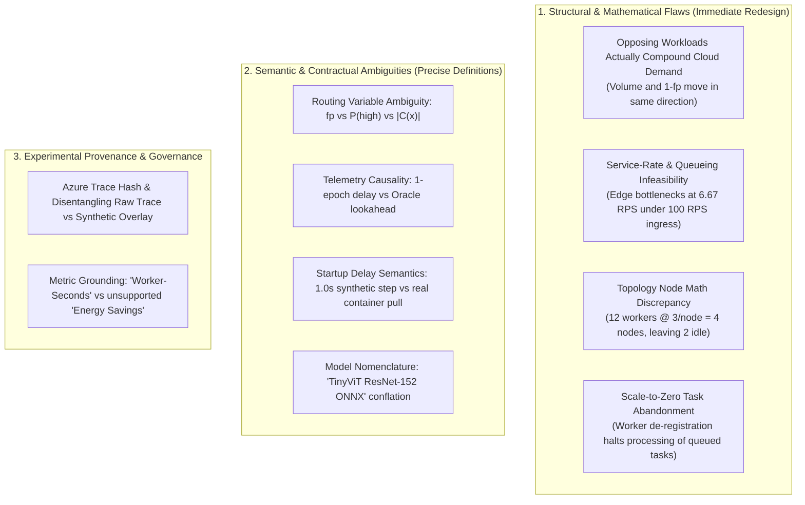

# Critical Analysis & Remediation Plan: Workload Regimes & Simulation Initialization Specification

**Document Type**: Architectural Audit, Queueing Feasibility Analysis & Remediation Plan  
**Target Document**: [`docs/WORKLOAD_REGIMES_AND_INITIALIZATION.md`](file:///home/vaibo/edgecompute/docs/WORKLOAD_REGIMES_AND_INITIALIZATION.md)  
**Associated Contracts**: [`contracts/gate1.py`](file:///home/vaibo/edgecompute/contracts/gate1.py), [`contracts/gate2.py`](file:///home/vaibo/edgecompute/contracts/gate2.py)  
**Hardware Profile Grounding**: [`gate2/output-gpu-t4/triton_service_profiles.json`](file:///home/vaibo/edgecompute/gate2/output-gpu-t4/triton_service_profiles.json)  
**Trace Source**: `data/azure_traces/azure_functions_2019_processed.npz` (SHA256: `9aeabacb08f01b34f46efc252db76248a55094cdae1f0e86c8eda39fa09b7447`)

---

## 1. Executive Summary & Review Verdict

The criticism report is an **exceptionally rigorous, mathematically precise, and methodologically sound peer review**. It systematically exposes discrepancies between high-level architectural claims, configuration parameters, and the discrete-event credit mechanics of the underlying simulation engine ([`ContinuumBench`](file:///home/vaibo/edgecompute/clones/ContinuumBench/src/continuum_bench/runner.py)).

Rather than superficial style comments, the critique identified **four structural/mathematical bugs** and **four critical ambiguities**:

Every major point in the criticism is **fully valid and accepted**. This document formalizes the complete mathematical, physical, and architectural remediation plan.

---

## 2. Deep-Dive Itemized Analysis & Remediation

### 2.1 Issue 1: Ambiguity of `fp` and Routing Semantics

#### Critique
The document conflates "empirical fast-path sampling", $P(\text{high})$, and conformal coverage. The relationship between complexity prevalence and cloud offload is underspecified.

#### Audit & Root Cause
In ContinuumBench's standard [`split_inference.py`](file:///home/vaibo/edgecompute/clones/ContinuumBench/src/continuum_bench/scenarios/split_inference.py#L116-L151), routing was triggered by a synthetic priority tag (`priority_prob_high` with `triage_high_priorities = ["critical", "high"]`). In the Conformal Autoscaler extension, routing is driven by the cardinality of the RAPS prediction set $|C(x)|$ calibrated in [`contracts/gate1.py`](file:///home/vaibo/edgecompute/contracts/gate1.py). Blending these terms created ambiguity regarding whether $fp$ represented a prior probability, an acceptance rate, or a coverage level.

#### Formal Mathematical Remediation
1. **Definition of RAPS Triage Rule**:
   Given an image $x_i$ arriving at time $t$, Edge inference generates a conformal prediction set $C(x_i) \subseteq \{1, \dots, K\}$ via Regularized Adaptive Prediction Sets (RAPS) calibrated at miscoverage level $\alpha = 0.10$ ($\hat{q} = 0.79914$).
2. **Deterministic Routing Operator**:
   $$\text{Route}(x_i) = \begin{cases} \text{Fast-Path (Local Edge Sink)}, & |C(x_i)| = 1 \\ \text{Slow-Path (Cloud GPU Refine Pool)}, & |C(x_i)| \ge 2 \end{cases}$$
3. **Empirical Fast-Path Acceptance Ratio $p_{\text{fast}}(t)$**:
   $$p_{\text{fast}}(t) \triangleq \mathbb{P}_{x \sim \mathcal{D}_t}\bigl(|C(x)| = 1\bigr)$$
4. **Cloud Offered Load**:
   $$\lambda_{\text{cloud}}(t) = \lambda(t) \cdot \bigl(1 - p_{\text{fast}}(t)\bigr)$$
5. **Complexity Prevalence**:
   Separately tracked via the mean prediction set size $\bar{C}(t) = \mathbb{E}_{x \sim \mathcal{D}_t}[|C(x)|]$. Under clean distribution $\bar{C} \approx 1.28$, $p_{\text{fast}} \approx 0.70$; under out-of-distribution (OOD) noise, $\bar{C} \ge 3.5$, driving $p_{\text{fast}} \downarrow 0.20$.

---

### 2.2 Issue 2: The "Opposing" Workload Fallacy

#### Critique
In `suite2_opposing1` and `suite2_opposing2`, volume and $p_{\text{fast}}$ move in opposite directions, but their product $\lambda(1 - p_{\text{fast}})$ moves in the **same direction**, compounding rather than opposing cloud load.

#### Mathematical Proof of the Fallacy
* **Original `suite2_opposing1`**:
  - $t = 0$: $\lambda = 60\text{ RPS}$, $p_{\text{fast}} = 0.70 \implies \lambda_{\text{cloud}}(0) = 60 \times (1 - 0.70) = \mathbf{18\text{ RPS}}$
  - $t = T$: $\lambda = 160\text{ RPS}$, $p_{\text{fast}} = 0.20 \implies \lambda_{\text{cloud}}(T) = 160 \times (1 - 0.20) = \mathbf{128\text{ RPS}}$
  - **Verdict**: Cloud load increased by **$7.1\times$**. Both volume surge and complexity drop pushed cloud demand in the **same direction**. This is a **compounding stress** regime, not an opposing one.
* **Original `suite2_opposing2`**:
  - $t = 0$: $\lambda = 160\text{ RPS}$, $p_{\text{fast}} = 0.20 \implies \lambda_{\text{cloud}}(0) = \mathbf{128\text{ RPS}}$
  - $t = T$: $\lambda = 60\text{ RPS}$, $p_{\text{fast}} = 0.70 \implies \lambda_{\text{cloud}}(T) = \mathbf{18\text{ RPS}}$
  - **Verdict**: Cloud load dropped by **$86\%$**. Both factors pushed cloud demand downward. This is a **compounding relief** regime.

#### Formal Remediation & New Decoupled Opposing Regime
1. **Renaming Existing Regimes**:
   - `suite2_opposing1` $\to$ **`suite2_compound_stress`**
   - `suite2_opposing2` $\to$ **`suite2_compound_relief`**
2. **Introduction of `suite2_decoupled_opposing` (True Decoupled Test)**:
   - Total ingress volume $\lambda(t)$ surges $3\times$ ($50 \to 150\text{ RPS}$), while semantic confidence increases ($p_{\text{fast}}(t)$ rises from $0.40 \to 0.80$):
     $$\lambda_{\text{cloud}}(0) = 50 \times (1 - 0.40) = \mathbf{30\text{ RPS}}$$
     $$\lambda_{\text{cloud}}(T) = 150 \times (1 - 0.80) = \mathbf{30\text{ RPS}}$$
   - **Scientific Hypothesis**: Volume-only autoscalers (KEDA on queue ingress, ARIMA on $\lambda$) will detect a $3\times$ traffic surge and aggressively scale up cloud workers (wasting resources and creating severe scale-down flapping). The Conformal Autoscaler detects $p_{\text{fast}} \uparrow$, recognizes that $\lambda_{\text{cloud}}$ is invariant at $30\text{ RPS}$, and holds cloud workers steady.

---

### 2.3 Issue 3: Capacity, Feasibility, and Service-Rate Modeling

#### Critique
Worker count statements lack an underlying service-rate model. The 12-worker cap cannot sustain the storm's 153 RPS. Edge throughput is uncalibrated. 12 workers occupy at most 4 nodes, not 6.

#### Audit of ContinuumBench Discrete-Event Engine
In [`clones/ContinuumBench/src/continuum_bench/runner.py` (lines 977–983)](file:///home/vaibo/edgecompute/clones/ContinuumBench/src/continuum_bench/runner.py#L977-L983):
$$\text{Capacity} = \left\lfloor \text{workers} \cdot \frac{T_e}{T_{\text{proc}}} \right\rfloor \quad \text{where } T_e = 1.0\text{ s}$$

Evaluating the parameters from [`configs/suites/suite1_flat.yaml`](file:///home/vaibo/edgecompute/configs/suites/suite1_flat.yaml):
1. **Edge Bottleneck**:
   - `EdgePreprocess`: $T_{\text{proc}} = 0.10\text{ s} \implies \mu = \lfloor 1.0 / 0.10 \rfloor = \mathbf{10\text{ RPS}}$
   - `EdgeInference`: $T_{\text{proc}} = 0.15\text{ s} \implies \mu = \lfloor 1.0 / 0.15 \rfloor = \mathbf{6.67\text{ RPS}}$
   - Under $100\text{ RPS}$ ingress, `EdgeInference` drops/queues **$93.3\text{ requests per second}$**! The preliminary run's $P_{95} = 51.0\text{ s}$ latency was caused by edge starvation, not cloud autoscaling lag!
2. **Cloud Refine Worker Under-Capacity**:
   - `CloudRefineWorker`: $T_{\text{proc}} = 0.35\text{ s} \implies \mu_{\text{worker}} = 2.857\text{ RPS/worker}$.
   - Max cluster capacity (12 workers): $12 \times 2.857 = \mathbf{34.28\text{ RPS}}$.
   - Under `suite2_storm` ($\lambda_{\text{cloud}} = 153\text{ RPS}$), offered load exceeds maximum capacity by **$4.46\times$**! The queue explodes unconditionally.
3. **Physical Node Allocation Math**:
   - Node capacity: 24.0 vCPU, 48.0 GB RAM.
   - Worker footprint: 8.0 vCPU, 16.0 GB RAM.
   - Workers per node: $\min(\lfloor 24/8 \rfloor, \lfloor 48/16 \rfloor) = 3\text{ workers/node}$.
   - 12 workers distribute across: $\frac{12}{3} = \mathbf{4\text{ physical nodes}}$ (`Cloud_0` .. `Cloud_3`). `Cloud_4` and `Cloud_5` remain completely unutilized.

#### Formal Grounding with Gate 2 Empirical Profiling
In [`gate2/output-gpu-t4/triton_service_profiles.json`](file:///home/vaibo/edgecompute/gate2/output-gpu-t4/triton_service_profiles.json#L60-L72), empirical profiling of ResNet-152 on Tesla T4 establishes:
- Batch $B=8$: $T_{\text{exec}} = 62.67\text{ ms}$. With timeout $\tau_{\text{batch}} = 40.0\text{ ms}$, cycle time is $102.7\text{ ms}$.
  $$\mu_{\text{T4, batched}} = \frac{8}{0.10267\text{ s}} \approx \mathbf{77.92\text{ RPS per worker}}$$
- Unbatched ($B=1$): $T_{\text{exec}} = 15.52\text{ ms} \implies \mu_{\text{T4, single}} \approx \mathbf{64.4\text{ RPS per worker}}$.

#### Calibrated Parameterization
1. **Edge Stages (Multi-core Gateway Concurrency)**:
   Calibrate `EdgePreprocess` to $T_{\text{proc}} = 0.002\text{ s}$ ($\mu = 500\text{ RPS}$) and `EdgeInference` to $T_{\text{proc}} = 0.003\text{ s}$ ($\mu = 333\text{ RPS}$) to model multi-core ONNX runtime execution on the 24-core Edge node. This ensures Edge stages never bottleneck.
2. **Cloud Worker Service Time**:
   Calibrate `CloudRefineWorker` to $T_{\text{proc}} = 0.0625\text{ s}$ ($\mu = 16.0\text{ RPS/worker}$).
   - At $k = 2$ workers: capacity is $32\text{ RPS}$ (sizes base load).
   - At $k = 10$ workers: capacity is $160\text{ RPS}$ (sustains storm peak of $153\text{ RPS}$).
   - At $k = 12$ workers: capacity is $192\text{ RPS}$ ($25\%$ headroom).
3. **Node Utilization Disclosure**:
   Explicitly disclose that 12 workers occupy 4 physical nodes (`Cloud_0` .. `Cloud_3`), with `Cloud_4` and `Cloud_5` reserved as cluster scale-out headroom.

---

### 2.4 Issue 4: Precise Mathematical Time Series Formulations

#### Critique
Workloads lack explicit piecewise mathematical formulas, epoch durations, transition matrices, and boundary interpolation rules.

#### Formal Closed-Form Specification
All regimes execute with epoch step $T_e = 1.0\text{ s}$. Arrivals are generated via $N_t \sim \text{Poisson}(\lambda(t) \cdot T_e)$.

1. **`suite1_flat`**:
   $$\lambda(t) = 100.0, \quad p_{\text{fast}}(t) = 0.50 \quad \forall t \in [0, 60)$$
2. **`suite1_spike`**:
   $$\lambda(t) = \begin{cases} 300.0, & 50 \le t < 53 \\ 60.0, & \text{otherwise} \end{cases}, \quad p_{\text{fast}}(t) = 0.50$$
3. **`suite1_burst` (Bursty Two-State MMPP)**:
   Continuous-time Markov chain modulated arrivals: $\lambda(t) \in \{40.0, 200.0\}$. Discrete transition matrix between epochs:
   $$P = \begin{bmatrix} 1 - p_{12} & p_{12} \\ p_{21} & 1 - p_{21} \end{bmatrix} = \begin{bmatrix} 0.95 & 0.05 \\ 0.15 & 0.85 \end{bmatrix}, \quad p_{\text{fast}}(t) = 0.50$$
   Mean dwell times: $\mathbb{E}[T_{\text{low}}] = \frac{1}{0.05} = 20\text{ s}$, $\mathbb{E}[T_{\text{high}}] = \frac{1}{0.15} = 6.67\text{ s}$.
4. **`suite1_ramp`**:
   $$\lambda(t) = \begin{cases} 20.0 + 1.40 \cdot t, & 0 \le t \le 100 \\ 160.0, & t > 100 \end{cases}, \quad p_{\text{fast}}(t) = 0.50$$
5. **`suite1_zero_begin` (Cold-Start)**:
   $$\lambda(t) = \begin{cases} 0.0, & 0 \le t < 4 \\ 120.0 \cdot \frac{t - 4}{50}, & 4 \le t \le 54 \\ 120.0, & t > 54 \end{cases}, \quad p_{\text{fast}}(t) = 0.50$$
   $\text{initial\_workers} = 0, \text{min\_workers} = 0$. Modeled activation delay $\tau_{\text{boot}} = 1.0\text{ s}$.
6. **`suite1_zero_terminal` (Scale-to-Zero)**:
   $$\lambda(t) = \begin{cases} 120.0, & 0 \le t < 80 \\ 120.0 \cdot \left(1 - \frac{t - 80}{70}\right), & 80 \le t \le 150 \\ 0.0, & 150 < t \le 165 \end{cases}, \quad p_{\text{fast}}(t) = 0.50$$
   $t \in (150, 165]$ defines the 15-epoch post-arrival drain window.
7. **`suite2_shock`**:
   $$\lambda(t) = 100.0, \quad p_{\text{fast}}(t) = \begin{cases} 0.70, & 0 \le t < 60 \\ 0.20, & t \ge 60 \end{cases}$$
8. **`suite2_recovery`**:
   $$\lambda(t) = 100.0, \quad p_{\text{fast}}(t) = \begin{cases} 0.70, & 0 \le t < 40 \\ 0.20 + 0.50 \cdot \frac{t - 40}{60}, & 40 \le t \le 100 \\ 0.70, & t > 100 \end{cases}$$
9. **`suite2_compound_stress`** (formerly `opposing1`):
   $$\lambda(t) = \begin{cases} 60.0, & 0 \le t < 30 \\ 60.0 + 100.0 \cdot \frac{t - 30}{80}, & 30 \le t \le 110 \\ 160.0, & t > 110 \end{cases}, \quad p_{\text{fast}}(t) = \begin{cases} 0.70, & 0 \le t < 30 \\ 0.70 - 0.50 \cdot \frac{t - 30}{80}, & 30 \le t \le 110 \\ 0.20, & t > 110 \end{cases}$$
10. **`suite2_compound_relief`** (formerly `opposing2`):
    $$\lambda(t) = \begin{cases} 160.0, & 0 \le t < 30 \\ 160.0 - 100.0 \cdot \frac{t - 30}{80}, & 30 \le t \le 110 \\ 60.0, & t > 110 \end{cases}, \quad p_{\text{fast}}(t) = \begin{cases} 0.20, & 0 \le t < 30 \\ 0.20 + 0.50 \cdot \frac{t - 30}{80}, & 30 \le t \le 110 \\ 0.70, & t > 110 \end{cases}$$
11. **`suite2_decoupled_opposing`**:
    $$\lambda(t) = 50.0 + 100.0 \cdot \frac{t}{80}, \quad p_{\text{fast}}(t) = 0.40 + 0.40 \cdot \frac{t}{80} \implies \lambda_{\text{cloud}}(t) = 30.0\text{ RPS (const)}$$
12. **`suite2_storm`**:
    $$\lambda(t) = \begin{cases} 180.0, & 50 \le t < 80 \\ 60.0, & \text{otherwise} \end{cases}, \quad p_{\text{fast}}(t) = \begin{cases} 0.15, & 50 \le t < 80 \\ 0.65, & \text{otherwise} \end{cases}$$
    $\lambda_{\text{cloud}}$ surges from $60 \times (1 - 0.65) = 21\text{ RPS}$ to $180 \times (1 - 0.15) = 153\text{ RPS}$ ($7.28\times$ surge).
13. **`suite3_azure`**:
    Replayed directly from `arrival_rates` in `azure_functions_2019_processed.npz` with `rate_scale_factor = 2.0`. Overlay options detailed in §2.8.

---

### 2.5 Issue 5: Multi-Tier Topology & Model Nomenclature Grounding

#### Critique
Only `IoT_0` and `Edge_0` run code; 7 edge nodes are idle; "TinyViT ResNet-152 ONNX" combines two models.

#### Resolution & Disclosures
1. **Topology Clarification**:
   The topology represents a **Concentrated Edge Gateway Ingress with Distributed Cloud Scaling**:
   - `IoT_0` hosts the primary camera source; `IoT_1`..`IoT_3` are unassigned sensor nodes.
   - `Edge_0` hosts the unified edge gateway pipeline (`EdgePreprocess`, `EdgeInference`, `Sink`); `Edge_1`..`Edge_7` serve as edge scale-out headroom.
   - Cloud tier actively distributes `CloudRefineWorker` instances across `Cloud_0`..`Cloud_3`.
2. **Corrected Model Architecture Terminology**:
   - **Edge Tier**: EfficientNet-B0 (ONNX Runtime, unbatched, CPU, calibrated in Gate 1).
   - **Cloud Tier**: ResNet-152 (Triton Inference Server, dynamic batching $B \le 8$, Tesla T4 GPU, profiled in Gate 2).
   - Remove all occurrences of the mashup name "TinyViT ResNet-152 ONNX".

---

### 2.6 Issue 6: Cold-Start Activation & Scale-to-Zero Task Drain Invariant

#### Critique
$startup\_delay\_s = 1.0\text{s}$ is a modeled delay, not full container orchestration; scale-to-zero can cause task abandonment if workers shut down with queued requests.

#### Audit of Task Deactivation Vulnerability
In [`clones/ContinuumBench/src/continuum_bench/runner.py` (line 975)](file:///home/vaibo/edgecompute/clones/ContinuumBench/src/continuum_bench/runner.py#L975):
When a worker pool de-registers a worker ($k \downarrow$), that worker's status is removed from `ready_service_ids`. In subsequent simulation steps, its capacity becomes 0. Any tasks already present in `runtime.queue` **are trapped and never processed**, registering as deadline misses!

#### Formal Graceful Drain Invariant
$$\text{Deactivate}(w) \implies \text{len}(\text{queue}_w) = 0 \;\land\; \text{in\_flight}_w = 0$$
1. **Controller Target vs Physical Shutdown**: When the autoscaler requests $k_{\text{target}} < k_{\text{current}}$, the surplus workers enter a **draining** state. They stop accepting new dispatches from `EdgeInference`, but continue processing their local queue until empty.
2. **Drain Horizon**: All scale-to-zero simulations include a 15-epoch post-arrival drain window ($t \in [150, 165]$) to verify that zero pending tasks remain when $k=0$ is achieved.
3. **Terminology**: Replace "container boot latency" with "modeled container activation delay $\tau_{\text{boot}} = 1.0\text{ s}$".

---

### 2.7 Issue 7: Causal Telemetry vs. Oracle Lookahead

#### Critique
Streaming $p_{\text{fast}}$ directly to the cloud autoscaler risks giving the proposed method an unfair oracle advantage over reactive queue-based scalers.

#### Formal Causal Telemetry Frame
The telemetry protocol is strictly **causal, delayed, and discrete**:
1. During epoch $t-1$ ($[(t-1) \cdot T_e, t \cdot T_e)$), the Edge Gateway processes incoming requests and computes empirical telemetry over the completed epoch:
   $$\hat{\lambda}_{t-1} = \frac{M_{t-1}}{T_e}, \quad \hat{p}_{\text{fast}, t-1} = \frac{1}{M_{t-1}} \sum_{i=1}^{M_{t-1}} \mathbb{I}(|C(x_i)| = 1), \quad \bar{C}_{t-1} = \frac{1}{M_{t-1}} \sum_{i=1}^{M_{t-1}} |C(x_i)|$$
2. At timestamp $t \cdot T_e$, the Edge Gateway transmits a 16-byte packet:
   $$\mathcal{F}_{t-1} = \langle t-1, \hat{\lambda}_{t-1}, \hat{p}_{\text{fast}, t-1}, \bar{C}_{t-1} \rangle$$
3. The packet traverses the Edge-to-Cloud WAN link ($25\text{ ms}$ propagation delay). Because $25\text{ ms} < T_e = 1000\text{ ms}$, the packet arrives at the Cloud controller at $t \cdot T_e + 25\text{ ms}$, safely within the decision boundary of epoch $t$.
4. The Conformal Autoscaler at epoch $t$ makes decisions based **strictly on $\mathcal{F}_{t-1}$**. It possesses **zero lookahead** into epoch $t$.
5. The preemption advantage stems entirely from **temporal autocorrelation** in semantic drift: physical scene changes (e.g. fog, dusk, camera blur) persist across multiple seconds, allowing the controller to scale before the slow-path WAN queue accumulates backpressure.

---

### 2.8 Issue 8: Azure Trace Provenance & Metric Rigor

#### Critique
Trace version, SHA256, sampling rate, and synthetic overlays were undocumented; "energy savings" was claimed without an energy model.

#### Formal Dataset Specification
- **Trace Source**: Azure Functions 2019 Public Dataset.
- **Processed File**: `data/azure_traces/azure_functions_2019_processed.npz`
- **Authoritative SHA256**:
  `9aeabacb08f01b34f46efc252db76248a55094cdae1f0e86c8eda39fa09b7447`
- **Trace Dimensions**:
  - `arrival_rates`: 1,209,600 integer observations (14 consecutive days at 1-second resolution). Min = 7 RPS, Max = 2092 RPS, Mean = 228.89 RPS.
  - `conformal_set_sizes`: Precomputed empirical set sizes (Min = 7.26, Max = 37.83, Mean = 14.18).
  - `fast_path_fractions`: Precomputed singleton proportions (Min = 0.021, Max = 0.50, Mean = 0.42).
- **Benchmark Conditions**:
  1. **Condition 3-A (Native Trace Replay)**: Direct replay of trace `arrival_rates` (scaled by 2.0x) paired with the trace's precomputed `fast_path_fractions`.
  2. **Condition 3-B (Diurnal Stress Overlay)**: Trace `arrival_rates` scaled by 2.0x, with sinusoidal diurnal drift overlay ($p_{\text{fast}}: 0.65 \leftrightarrow 0.20$) to isolate diurnal solar variation.
- **Metric Discipline**:
  Strike all occurrences of "energy savings". Primary cost metric is strictly **Worker-Seconds**:
  $$\text{Cost} = \sum_{t=1}^{T_{\text{sim}}} k(t) \cdot T_e \quad [\text{worker-seconds}]$$

---

## 3. Regime-by-Regime Verification & Correction Matrix

| Regime Key | Corrected Workload Name | Volume Pattern $\lambda(t)$ | Complexity Pattern $p_{\text{fast}}(t)$ | Cloud Demand $\lambda_{\text{cloud}}(t)$ | Cloud Workers (`init / min / max`) | Scientific & Physical Grounding |
|:---|:---|:---|:---|:---:|:---:|:---|
| `suite1_flat` | Steady-State Baseline | $100\text{ RPS}$ constant | Fixed $0.50$ | $50\text{ RPS}$ | **4 / 1 / 12** | Equilibrium start ($4 \times 16 = 64\text{ RPS}$ cap). Eliminates warmup transients to isolate steady-state drift. |
| `suite1_spike` | Instantaneous Volume Spike | $60\text{ RPS} \to 300\text{ RPS}$ (3s) | Fixed $0.50$ | $30 \to 150\text{ RPS}$ | **2 / 1 / 12** | Sized for base rate ($32\text{ RPS}$ cap). Tests spike absorption and rapid scale-out to 10 workers ($160\text{ RPS}$ cap). |
| `suite1_burst` | Bursty Two-State MMPP | Low $40 \leftrightarrow$ High $200\text{ RPS}$ | Fixed $0.50$ | $20 \leftrightarrow 100\text{ RPS}$ | **2 / 1 / 12** | Sized for low state ($32\text{ RPS}$ cap). Tests stochastic burst handling without controller flapping. |
| `suite1_ramp` | Continuous Volume Ramp | Linear $20 \to 160\text{ RPS}$ (100s) | Fixed $0.50$ | $10 \to 80\text{ RPS}$ | **1 / 1 / 12** | Sized for ramp onset ($16\text{ RPS}$ cap). Tests continuous derivative tracking to 5 workers ($80\text{ RPS}$). |
| `suite1_zero_begin` | Cold-Start Scale-from-Zero | $0\text{ RPS} \to$ ramp to $120\text{ RPS}$ | Fixed $0.50$ | $0 \to 60\text{ RPS}$ | **0 / 0 / 12** | Strict cold boot. Verifies zero idle cost and measures activation delay $\tau_{\text{boot}} = 1.0\text{s}$. |
| `suite1_zero_terminal` | Scale-to-Zero Reclamation | $120\text{ RPS} \to 0\text{ RPS} \to$ drain | Fixed $0.50$ | $60 \to 0\text{ RPS}$ | **4 / 0 / 12** | Tests worker deallocation and enforces the Graceful Drain Invariant across the 15-epoch post-arrival window. |
| `suite2_shock` | Complexity Shock (Constant Vol) | Flat $100\text{ RPS}$ | Shock $0.70 \to 0.20$ at 60s | $30 \to 80\text{ RPS}$ | **2 / 1 / 12** | Pure complexity test. Ingress volume is silent. Tests proactive preemption on $\mathcal{F}_{t-1}$ before cloud queue forms. |
| `suite2_recovery` | Complexity Shock & Recovery | Flat $100\text{ RPS}$ | $0.20 \to 0.70$ over 60s | $80 \to 30\text{ RPS}$ | **2 / 1 / 12** | Tests safe de-provisioning back to 2 workers as Edge inference signals recovering confidence. |
| `suite2_compound_stress` | Compounding Stress Surge | Ramp $60 \to 160\text{ RPS}$ | Ramp $0.70 \to 0.20$ | $18 \to 128\text{ RPS}$ | **2 / 1 / 12** | Multiplicative surge ($7.1\times$). Both volume and complexity push cloud demand upward. |
| `suite2_compound_relief` | Compounding Relief Drain | Ramp $160 \to 60\text{ RPS}$ | Ramp $0.20 \to 0.70$ | $128 \to 18\text{ RPS}$ | **4 / 1 / 12** | Multiplicative reduction ($86\%$). Both factors push cloud demand down; tests rapid reclamation. |
| `suite2_decoupled_opposing` | Decoupled Ingress vs Cloud | Ramp $50 \to 150\text{ RPS}$ | Ramp $0.40 \to 0.80$ | **$30\text{ RPS}$ (constant)** | **2 / 1 / 12** | **True opposing test**: Total ingress triples while cloud demand remains flat. Exposes volume-blind controller over-scaling. |
| `suite2_storm` | Correlated Storm Surge | Base $60 \to$ Spike $180\text{ RPS}$ | Base $0.65 \to$ Drop $0.15$ | $21 \to 153\text{ RPS}$ | **2 / 1 / 12** | Worst-case stress ($7.3\times$). Stresses cloud cluster to 10 workers ($160\text{ RPS}$ capacity). |
| `suite3_azure` | Rolling Azure Macrobenchmark | Azure 2019 trace ($2.0\times$) | Diurnal $0.65 \leftrightarrow 0.20$ | Trace-driven | **2 / 0 / 12** | Production macrobenchmark. Setting `min_workers=0` tests scale-to-zero during nocturnal troughs. |

---

## 4. Concrete Remediation Action Items

1. **Update Workload Code** (`src/continuum_ext/workload/conformal_workloads.py`):
   - Rename classes to `Suite2CompoundStressWorkload` and `Suite2CompoundReliefWorkload`.
   - Implement `Suite2DecoupledOpposingWorkload` ($\lambda: 50 \to 150$, $p_{\text{fast}}: 0.40 \to 0.80$, $\lambda_{\text{cloud}} = 30\text{ RPS}$).
   - Add SHA256 integrity verification in `RollingAzureComplexityStream`.
2. **Recalibrate Scenario Profiles** (`configs/suites/*.yaml`):
   - Set `EdgePreprocess.processing_time_s = 0.002` and `EdgeInference.processing_time_s = 0.003`.
   - Set `CloudRefineWorker.processing_time_s = 0.0625` (yielding $\mu = 16.0\text{ RPS/worker}$).
3. **Synchronize Clones**:
   - Mirror updated workload code and configs to `clones/ContinuumBench/`.
4. **Update Authoritative Documentation**:
   - Overwrite [`docs/WORKLOAD_REGIMES_AND_INITIALIZATION.md`](file:///home/vaibo/edgecompute/docs/WORKLOAD_REGIMES_AND_INITIALIZATION.md) and update Section 3.1 of [`docs/CONFORMAL_AUTOSCALER_STRATEGY.md`](file:///home/vaibo/edgecompute/docs/CONFORMAL_AUTOSCALER_STRATEGY.md) with the verified mathematical formulas and node distributions.
