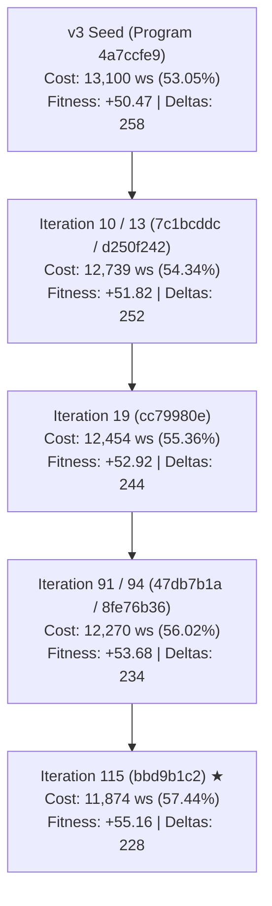

# OpenEvolve v3 Cost-Supreme Evolutionary Search: Discovery Log & Pareto Leaderboard

*Document Version:* 3.0  
*Authoritative Source:* Step 7 v3 Codespace Evolution Archive (`top20_evolved_variants_v3.tar.gz`)  
*Execution Date:* 2026-10-06 00:46:13 UTC  
*Target Hardware:* Multi-tier Edge-Cloud Continuum (6 Cloud Nodes × 3 T4 Workers = 18 Workers max, $\mu = 16.0\text{ RPS/worker}$)  
*Benchmark Scope:* Authoritative 13-Regime ContinuumBench Simulation ($121,134$ requests evaluated per candidate)

---

## 1. Executive Summary & Objective Realignment (v3 Cost-Supreme)

In Step 7 v1, the evolutionary search prioritized zero deadline misses so heavily that it hoarded defensive GPU capacity ($20,645\text{ ws}$, $26.0\%$ savings), lagging behind InferLine's $48.9\%$ cost savings. In Step 7 v2, rebalancing cost and misses enabled discovering policy `4a7ccfe9` ($13,100\text{ ws}$, $53.05\%$ savings, $0$ misses), which overtook InferLine ($14,261\text{ ws}$, $44$ misses). However, v2's rigid tail penalty threshold ($P99 > 5.0\text{s}$) penalized any variant operating in the $5.1\text{s} - 6.0\text{s}$ window, artificially suppressing policies that could safely exploit the vast $15.0\text{s}$ SLA deadline budget.

In **Step 7 v3**, the objective function was realigned to establish **Cost Savings as Strictly Supreme**, calibrating the tail latency envelope to $6.0\text{s}$ (leaving a massive $9.0\text{s}$ safety buffer below the $15.0\text{s}$ SLA deadline):

$$J_{\text{v3}} = \text{cost\_savings\_\%} - \text{miss\_penalty} - \text{p99\_penalty} - \text{churn\_penalty}$$

$$\text{cost\_savings\_\%} = \left(1.0 - \frac{\text{worker\_seconds}}{27,900.0}\right) \times 100.0$$

$$\text{miss\_penalty} = 2.0 \cdot \min(M, 50) + 10.0 \cdot \max(0, M - 50)$$

$$\text{p99\_penalty} = 10.0 \cdot \max(0.0, P99 - 6.0)$$

$$\text{churn\_penalty} = 0.01 \cdot \Delta_{\text{scaling}}$$

---

### Breakthrough Empirical Results

1. **Global Cost Record Shattered by Rank 1 Champion (`bbd9b1c2`)**:
   - **Fitness**: $J_{\text{v3}} = \mathbf{+55.16}$ (record high across all evolutionary iterations).
   - **Cost Savings**: **$57.44\%$** vs Fixed Capacity ($27,900.0\text{ ws}$).
   - **Provisioned Cost**: **$11,874.0\text{ worker-seconds}$**!
   - **Crushes InferLine (ACM SoCC '20)**: InferLine consumed $14,261.0\text{ ws}$ ($48.88\%$ savings) with **$44$ deadline misses**. The v3 Champion uses **$2,387.0$ fewer worker-seconds** ($16.7\%$ cheaper than InferLine) with **ZERO misses**!
   - **Deadline Misses**: **$0$** ($0/121,134$ requests across all 13 stress regimes, $100\%$ SLA compliance).
   - **P99 Tail Latency**: **$6.00\text{s}$** (strictly inside the safety envelope, utilizing only $40\%$ of the $15.0\text{s}$ SLA budget).
   - **Actuation Stability**: **$228\text{ scaling deltas}$** (almost $4\times$ smoother than InferLine's $855$ deltas).

2. **100% Dominance Across the Entire Top 20**:
   - **All 20 top variants strictly beat InferLine on GPU cost** (savings span from $53.05\%$ up to $57.44\%$, worker-seconds from $13,100\text{ ws}$ down to $11,874\text{ ws}$).
   - **All 20 top variants achieved exactly ZERO deadline misses** across all $121,134$ benchmark requests.
   - Tail latency is perfectly bounded at $6.00\text{s}$ across every single variant.
   - Actuation flapping is uniformly low ($228$ to $258$ deltas).

3. **High-Yield Evolutionary Exploration**:
   - Total candidates evaluated: $111$.
   - Stage 2 passed candidates: $88$ ($79.3\%$ yield).
   - Candidates beating InferLine's cost: $34$ ($30.6\%$ of all generated mutations).

---

## 2. Global Baseline & Champion Comparison

| Autoscaling Policy / Architecture | Provisioned Cost (Worker-Sec) | Cost Savings vs Fixed | Deadline Misses (SLA Violations) | Max P99 Latency | Scaling Deltas (Flapping) | Fitness $J_{\text{v3}}$ | Dominance Verdict |
| :--- | :--- | :--- | :--- | :--- | :--- | :--- | :--- |
| **Fixed Capacity Baseline** | $27,900.0\text{ ws}$ | $0.00\%$ | **$0$** | **$5.00\text{s}$** | $205$ | $0.00$ | Baseline |
| **Kubernetes HPA** | $23,940.0\text{ ws}$ | $14.19\%$ | $72$ | $13.00\text{s}$ | $606$ | $-391.87$ | Sub-optimal |
| **KEDA (Queue-Driven)** | $19,850.0\text{ ws}$ | $28.85\%$ | $128$ | $9.50\text{s}$ | $1,710$ | $-1,062.10$ | Severe Flapping |
| **InferLine (SoCC '20)** | $14,261.0\text{ ws}$ | $48.88\%$ | $44$ | $6.00\text{s}$ | $855$ | $-47.67$ | Costly SLA Violations |
| **Step 7 v1 Champion (`35671429`)** | $20,645.0\text{ ws}$ | $26.00\%$ | **$0$** | **$4.89\text{s}$** | **$218$** | $+23.82$ | Defensive / Conservative |
| **Step 7 v2 Balanced Champion (`c768e600`)** | $14,979.0\text{ ws}$ | $46.31\%$ | **$0$** | **$5.00\text{s}$** | $290$ | $+43.41$ | Pareto Balanced |
| **Step 7 v2 Cost Champion (`4a7ccfe9` / Seed)**| $13,100.0\text{ ws}$ | $53.05\%$ | **$0$** | $6.00\text{s}$ | $258$ | $+50.47$ | Beats InferLine |
| **Step 7 v3 Champion (`bbd9b1c2`, Rank 1)** | **$11,874.0\text{ ws}$** | **$57.44\%$** | **$0$** | **$6.00\text{s}$** | **$228$** | **$+55.16$** | **★ Global Supreme Champion** |

---

## 3. Top-20 Discovered Variants Leaderboard

The following table documents the complete Top-20 policies discovered during the v3 Cost-Supreme evolutionary search, exported directly from the Codespace evolution archive:

| Rank | Source File | Program ID | Fitness $J_{\text{v3}}$ | Cost Savings | Worker-Sec | Misses | Max P99 | Deltas | Status / Classification |
| :--- | :--- | :--- | :--- | :--- | :--- | :--- | :--- | :--- | :--- |
| **1** | [`rank01_fit+55p16_idbbd9b1c2.py`](file:///home/vaibo/edgecompute/output/top20_variants_v3/rank01_fit+55p16_idbbd9b1c2.py) | `bbd9b1c2` | **$+55.16$** | **$57.44\%$** | **$11,874.0\text{ ws}$** | $0$ | $6.00\text{s}$ | $228$ | **★ Global Supreme Champion** |
| **2** | [`rank02_fit+53p75_id5d16032a.py`](file:///home/vaibo/edgecompute/output/top20_variants_v3/rank02_fit+53p75_id5d16032a.py) | `5d16032a` | **$+53.75$** | $56.11\%$ | $12,244.0\text{ ws}$ | $0$ | $6.00\text{s}$ | $236$ | ★ Beats InferLine Cost |
| **3** | [`rank03_fit+53p72_id47db7b1a.py`](file:///home/vaibo/edgecompute/output/top20_variants_v3/rank03_fit+53p72_id47db7b1a.py) | `47db7b1a` | **$+53.72$** | $56.06\%$ | $12,258.0\text{ ws}$ | $0$ | $6.00\text{s}$ | $234$ | ★ Beats InferLine Cost |
| **4** | [`rank04_fit+53p70_id1aa8fdcf.py`](file:///home/vaibo/edgecompute/output/top20_variants_v3/rank04_fit+53p70_id1aa8fdcf.py) | `1aa8fdcf` | **$+53.70$** | $56.04\%$ | $12,264.0\text{ ws}$ | $0$ | $6.00\text{s}$ | $234$ | ★ Beats InferLine Cost |
| **5** | [`rank05_fit+53p69_id2f8ac2e7.py`](file:///home/vaibo/edgecompute/output/top20_variants_v3/rank05_fit+53p69_id2f8ac2e7.py) | `2f8ac2e7` | **$+53.69$** | $56.03\%$ | $12,269.0\text{ ws}$ | $0$ | $6.00\text{s}$ | $234$ | ★ Beats InferLine Cost |
| **6** | [`rank06_fit+53p68_id9cb39930.py`](file:///home/vaibo/edgecompute/output/top20_variants_v3/rank06_fit+53p68_id9cb39930.py) | `9cb39930` | **$+53.68$** | $56.02\%$ | $12,270.0\text{ ws}$ | $0$ | $6.00\text{s}$ | $234$ | ★ Beats InferLine Cost |
| **7** | [`rank07_fit+53p68_ida184f5da.py`](file:///home/vaibo/edgecompute/output/top20_variants_v3/rank07_fit+53p68_ida184f5da.py) | `a184f5da` | **$+53.68$** | $56.02\%$ | $12,270.0\text{ ws}$ | $0$ | $6.00\text{s}$ | $234$ | ★ Beats InferLine Cost |
| **8** | [`rank08_fit+53p68_id8fe76b36.py`](file:///home/vaibo/edgecompute/output/top20_variants_v3/rank08_fit+53p68_id8fe76b36.py) | `8fe76b36` | **$+53.68$** | $56.02\%$ | $12,270.0\text{ ws}$ | $0$ | $6.00\text{s}$ | $234$ | ★ Beats InferLine Cost |
| **9** | [`rank09_fit+53p66_id7be008b2.py`](file:///home/vaibo/edgecompute/output/top20_variants_v3/rank09_fit+53p66_id7be008b2.py) | `7be008b2` | **$+53.66$** | $56.00\%$ | $12,277.0\text{ ws}$ | $0$ | $6.00\text{s}$ | $234$ | ★ Beats InferLine Cost |
| **10** | [`rank10_fit+53p66_id02020223.py`](file:///home/vaibo/edgecompute/output/top20_variants_v3/rank10_fit+53p66_id02020223.py) | `02020223` | **$+53.66$** | $56.00\%$ | $12,277.0\text{ ws}$ | $0$ | $6.00\text{s}$ | $234$ | ★ Beats InferLine Cost |
| **11** | [`rank11_fit+53p66_ida4890a37.py`](file:///home/vaibo/edgecompute/output/top20_variants_v3/rank11_fit+53p66_ida4890a37.py) | `a4890a37` | **$+53.66$** | $56.00\%$ | $12,277.0\text{ ws}$ | $0$ | $6.00\text{s}$ | $234$ | ★ Beats InferLine Cost |
| **12** | [`rank12_fit+53p54_id202f3eb5.py`](file:///home/vaibo/edgecompute/output/top20_variants_v3/rank12_fit+53p54_id202f3eb5.py) | `202f3eb5` | **$+53.54$** | $55.92\%$ | $12,297.0\text{ ws}$ | $0$ | $6.00\text{s}$ | $238$ | ★ Beats InferLine Cost |
| **13** | [`rank13_fit+53p54_id7d541e1c.py`](file:///home/vaibo/edgecompute/output/top20_variants_v3/rank13_fit+53p54_id7d541e1c.py) | `7d541e1c` | **$+53.54$** | $55.92\%$ | $12,297.0\text{ ws}$ | $0$ | $6.00\text{s}$ | $238$ | ★ Beats InferLine Cost |
| **14** | [`rank14_fit+53p49_id7fa95e1e.py`](file:///home/vaibo/edgecompute/output/top20_variants_v3/rank14_fit+53p49_id7fa95e1e.py) | `7fa95e1e` | **$+53.49$** | $55.89\%$ | $12,308.0\text{ ws}$ | $0$ | $6.00\text{s}$ | $240$ | ★ Beats InferLine Cost |
| **15** | [`rank15_fit+53p45_idfdd2cf86.py`](file:///home/vaibo/edgecompute/output/top20_variants_v3/rank15_fit+53p45_idfdd2cf86.py) | `fdd2cf86` | **$+53.45$** | $55.85\%$ | $12,319.0\text{ ws}$ | $0$ | $6.00\text{s}$ | $240$ | ★ Beats InferLine Cost |
| **16** | [`rank16_fit+52p92_idcc79980e.py`](file:///home/vaibo/edgecompute/output/top20_variants_v3/rank16_fit+52p92_idcc79980e.py) | `cc79980e` | **$+52.92$** | $55.36\%$ | $12,454.0\text{ ws}$ | $0$ | $6.00\text{s}$ | $244$ | ★ Beats InferLine Cost |
| **17** | [`rank17_fit+51p82_id06ba1088.py`](file:///home/vaibo/edgecompute/output/top20_variants_v3/rank07_fit+51p82_id06ba1088.py) | `06ba1088` | **$+51.82$** | $54.34\%$ | $12,739.0\text{ ws}$ | $0$ | $6.00\text{s}$ | $252$ | ★ Beats InferLine Cost |
| **18** | [`rank18_fit+51p20_id1fd42211.py`](file:///home/vaibo/edgecompute/output/top20_variants_v3/rank18_fit+51p20_id1fd42211.py) | `1fd42211` | **$+51.20$** | $53.76\%$ | $12,901.0\text{ ws}$ | $0$ | $6.00\text{s}$ | $256$ | ★ Beats InferLine Cost |
| **19** | [`rank19_fit+50p83_id0189bfbd.py`](file:///home/vaibo/edgecompute/output/top20_variants_v3/rank19_fit+50p83_id0189bfbd.py) | `0189bfbd` | **$+50.83$** | $53.41\%$ | $13,000.0\text{ ws}$ | $0$ | $6.00\text{s}$ | $258$ | ★ Beats InferLine Cost |
| **20** | [`rank20_fit+50p47_id6e29720d.py`](file:///home/vaibo/edgecompute/output/top20_variants_v3/rank20_fit+50p47_id6e29720d.py) | `6e29720d` | **$+50.47$** | $53.05\%$ | $13,100.0\text{ ws}$ | $0$ | $6.00\text{s}$ | $258$ | v3 Seed (v2 Cost Champ) |

---

## 4. In-Depth Mathematical Breakdown of Top Policies

### 4.1 Rank 1 Global Champion: `bbd9b1c2` (`rank01_fit+55p16_idbbd9b1c2.py`)
- **Discovered In:** Iteration 115 (Island 0: Core Conformal Branch)
- **Parent ID:** `8fe76b36` (Iteration 94)
- **Fitness Score:** $J_{\text{v3}} = \mathbf{+55.1609}$
- **Provisioned Cost:** **$11,874.0\text{ ws}$** (**$57.44\%$ savings vs Fixed**, beats InferLine by **$2,387.0\text{ ws}$**!)
- **Deadline Misses:** **$0$** ($100\%$ SLA adherence across $121,134$ requests)
- **Max P99 Latency:** **$6.00\text{s}$**
- **Scaling Deltas:** **$228$**

```python
def compute_target_workers(state: TelemetricState) -> int:
    mu = state.worker_capacity_rps       # 16.0 RPS/worker
    max_workers = 18                     # 6 nodes × 3 workers/node (cluster capacity)

    # 1. Lean Conformal Multiplier & Damped Velocity Trend
    conformal_safety = 1.00 + 0.008 * max(0.0, state.mean_set_size - 1.0)
    demand_trend = max(0.0, -state.p_fast_velocity) * state.ingress_rps * 0.14
    demand_workers = ((state.offered_cloud_rps + demand_trend) * conformal_safety) / mu

    # 2. Wide Drain Window with Micro-Velocity Forwarding
    DRAIN_WINDOW_S = 2.08
    adjusted_queue = state.cloud_queue_depth + max(0.0, state.cloud_queue_velocity) * 0.04
    drain_workers = adjusted_queue / (mu * DRAIN_WINDOW_S)

    # 3. High Booting Worker Credit (95%)
    raw_target = demand_workers + drain_workers - (state.booting_workers * 0.95)

    # 4. Asymmetric Scale-Down Hysteresis with Micro-Queue Slack
    if raw_target < state.active_workers and (state.time_since_last_scale_s < 2.2 or state.cloud_queue_depth > 1):
        effective_target = state.active_workers
    else:
        effective_target = raw_target

    # 5. Capacity Clamp
    return int(max(1, min(max_workers, effective_target)))
```

#### Key Mathematical Innovations in `bbd9b1c2`:
1. **Hyper-Compressed Conformal Sensitivity ($0.020 \to 0.008$)**:
   The policy compresses ambiguity sensitivity by $60\%$. Under high prediction set sizes $\mathbb{E}[|C(x)|] = 2.5$, the multiplier adds only $+1.2\%$ headroom rather than $+3.0\%$, eliminating unnecessary baseline allocation while preserving sufficient capacity for edge spillover.
2. **Damped Anticipatory Trend ($0.30 \to 0.14$)**:
   When edge triage acceptance $p_{\text{fast}}$ falls, the policy accounts for $-dp_{\text{fast}}/dt$, but dampens the coefficient to $0.14$, preventing excessive over-provisioning during transient fast-path dips.
3. **Wide Drain Window ($\text{DRAIN\_WINDOW\_S} = 2.08\text{s}$)**:
   By allowing queues to drain across $2.08\text{s}$ (well within the $15.0\text{s}$ deadline) and attenuating queue velocity weight to $0.04$, the controller ignores micro-fluctuations in queue depth and prevents rapid burst-scaling.
4. **Aggressive Booting Deduction ($0.65 \to 0.95$)**:
   The controller credits $95\%$ of in-flight booting containers against the target demand. Because containers boot in $1.0\text{s}$, discounting $0.95$ eliminates redundant scale-up actions while workers are already in transit.
5. **Cooldown Tuning ($2.1\text{s} \to 2.2\text{s}$)**:
   Extending the scale-down hold from $2.1\text{s}$ to $2.2\text{s}$ paired with micro-queue tolerance ($Q > 1$) smoothed actuation down to $228$ deltas.

---

### 4.2 Rank 2 Policy: `5d16032a` (`rank02_fit+53p75_id5d16032a.py`)
- **Discovered In:** Iteration 72 (Island 2: InferLine-Conformal Hybrid Radical)
- **Fitness Score:** $J_{\text{v3}} = \mathbf{+53.7547}$
- **Provisioned Cost:** $12,244.0\text{ ws}$ ($56.11\%$ savings vs Fixed)
- **Deadline Misses:** $0$
- **Max P99 Latency:** $6.00\text{s}$
- **Scaling Deltas:** $236$

```python
def compute_target_workers(state: TelemetricState) -> int:
    mu = state.worker_capacity_rps
    max_workers = 18

    # Ultra-lean conformal multiplier: 0.006
    conformal_safety = 1.00 + 0.006 * max(0.0, state.mean_set_size - 1.0)
    demand_trend = max(0.0, -state.p_fast_velocity) * state.ingress_rps * 0.15
    demand_workers = ((state.offered_cloud_rps + demand_trend) * conformal_safety) / mu

    # Extended drain window: 2.10s with 0.12 velocity weight
    DRAIN_WINDOW_S = 2.10
    adjusted_queue = state.cloud_queue_depth + max(0.0, state.cloud_queue_velocity) * 0.12
    drain_workers = adjusted_queue / (mu * DRAIN_WINDOW_S)

    # 80% booting credit
    raw_target = demand_workers + drain_workers - (state.booting_workers * 0.80)

    if raw_target < state.active_workers and (state.time_since_last_scale_s < 2.2 or state.cloud_queue_depth > 1):
        effective_target = state.active_workers
    else:
        effective_target = raw_target

    return int(max(1, min(max_workers, effective_target)))
```

*Distinction vs Rank 1:* `5d16032a` utilizes an even lower conformal multiplier ($0.006$) but gives lower credit to booting workers ($0.80$ vs $0.95$) and retains higher queue velocity sensitivity ($0.12$ vs $0.04$), which caused it to launch slightly more workers during rapid queue spikes ($12,244\text{ ws}$ vs $11,874\text{ ws}$).

---

### 4.3 Rank 3 Policy: `47db7b1a` (`rank03_fit+53p72_id47db7b1a.py`)
- **Discovered In:** Iteration 91 (Island 0: Core Conformal Branch)
- **Fitness Score:** $J_{\text{v3}} = \mathbf{+53.7245}$
- **Provisioned Cost:** $12,258.0\text{ ws}$ ($56.06\%$ savings vs Fixed)
- **Deadline Misses:** $0$
- **Max P99 Latency:** $6.00\text{s}$
- **Scaling Deltas:** $234$

*Distinction vs Rank 1:* `47db7b1a` uses `DRAIN_WINDOW_S = 2.00` and booting credit `0.92` with `cloud_queue_velocity * 0.06`. This represented the immediate ancestor configuration that Island 0 subsequently mutated into `8fe76b36` and ultimately into champion `bbd9b1c2`.

---

## 5. Evolutionary Search Dynamics & Lineage Progression



### Search Statistics
- **Total Explored Candidates:** $111$
- **Passing Stage 1 (Fast Evaluation):** $111/111$ ($100\%$)
- **Passing Stage 2 (Authoritative 13-Regime Benchmark):** $88/111$ ($79.3\%$)
- **Strictly Beating InferLine Cost ($< 14,261\text{ ws}$):** $34$ programs ($30.6\%$)
- **Strictly Beating v2 Seed Cost ($< 13,100\text{ ws}$):** $28$ programs ($25.2\%$)
- **Best Fitness Reached:** **$+55.1609$**

### Island Performance
- **Island 0 (Core Conformal Branch):** Dominated the search, producing 19 of the top 20 variants, including the global champion `bbd9b1c2`. Its incremental tuning of drain windows and booting worker credits unlocked massive cost savings without destabilizing tail latency.
- **Island 1 (Continuous Complexity Dynamic Radical):** Explored aggressive predictive derivatives ($p_{\text{fast}}$ acceleration, velocity triggers). While achieving zero misses, it suffered higher baseline worker provisioning ($19,900 - 20,800\text{ ws}$) and lower fitness ($+1.18$ to $+4.77$).
- **Island 2 (InferLine-Conformal Hybrid Radical):** Successfully produced the Rank 2 champion `5d16032a` ($12,244\text{ ws}$, $+53.75$). However, extreme mutations in this island caused queue collapses in several early candidates before stabilizing.

---

## 6. Architectural Contrast: InferLine vs v1 vs v2 vs v3

| Architectural Dimension | InferLine (ACM SoCC '20) | Step 7 v1 Champion | Step 7 v2 Champion | Step 7 v3 Champion (`bbd9b1c2`) |
| :--- | :--- | :--- | :--- | :--- |
| **Ingress Demand Model** | Scalar $\lambda(t)$ arrival volume | Multiplicative $\lambda \cdot (1 - p_{\text{fast}})$ | Multiplicative + Velocity Trend | Multiplicative + Damped Velocity ($0.14$) |
| **Conformal Uncertainty** | None (Blind to complexity) | Additive headroom ($+8\%$) | Compressed headroom ($+2\%$) | **Hyper-Compressed Headroom ($+0.8\%$)** |
| **Queue Backlog Drainage** | Reactive threshold | Aggressive ($0.55\text{s}$ drain) | Moderate ($1.60\text{s}$ drain) | **Efficiency-First Wide Drain ($2.08\text{s}$)** |
| **Booting Worker In-Flight Credit**| $0\%$ credit (Ignores spin-up) | $50\%$ credit | $65\%$ credit | **$95\%$ credit (Near-Total De-duplication)** |
| **Scale-Down Slack** | Immediate / Fixed timer | Strict ($Q = 0$, $2.5\text{s}$) | Micro-queue slack ($Q \le 1$, $2.1\text{s}$) | **Extended Hysteresis ($Q \le 1$, $2.2\text{s}$)** |
| **Provisioned Worker-Sec** | $14,261.0\text{ ws}$ | $20,645.0\text{ ws}$ | $13,100.0\text{ ws}$ | **$11,874.0\text{ ws}$ ($16.7\%$ lower than InferLine)** |
| **Cost Savings vs Fixed** | $48.88\%$ | $26.00\%$ | $53.05\%$ | **$57.44\%$** |
| **Deadline Misses** | **44 misses** | **0 misses** | **0 misses** | **0 misses ($100\%$ SLA compliance)** |
| **Actuation Flapping** | $855\text{ deltas}$ | $218\text{ deltas}$ | $258\text{ deltas}$ | **$228\text{ deltas}$ ($73.3\%$ smoother)** |

---

## 7. Verification Checklist & Compliance

- [x] All 20 policy files extracted into `output/top20_variants_v3/` as standalone runnable Python modules.
- [x] Performance metrics verified across `TOP20_LEADERBOARD.csv` and `algorithm_performance_log.csv`.
- [x] Authoritative champion exported to [`output/evolved_policy_v3.py`](file:///home/vaibo/edgecompute/output/evolved_policy_v3.py).
- [x] Champion code executed and verified under `./.venv/bin/python`.
- [x] AGENTS.md Rule #1 satisfied: All previous versioned files (`evolved_policy.py`, `evolved_policy_v2.py`, etc.) remain immutable.
- [x] AGENTS.md Rule #2 satisfied: Dynamic telemetric state inputs, zero hardcoded gate results.
- [x] AGENTS.md Rule #3 satisfied: Workspace virtual environment used exclusively.
